# MCUboot-based basic bootloader

[MCUboot](https://github.com/mcu-tools/mcuboot) is an open-source library enabling the development of secure bootloader applications for 32-bit MCUs. MCUboot is the primary bootloader in popular IoT operating systems such as Zephyr and Apache Mynewt. This code example demonstrates a bootloader using MCUboot with PSoC&trade; 62 and XMC7200 MCUs. This code example bundles two applications:

- **Bootloader app:** Implements an MCUboot-based basic bootloader application run by CM0P core. The bootloader handles image authentication and upgrades it. When the image is valid, the bootloader lets the CM4 or CM7 core, boot the image by passing the starting address of the primary slot.

- **Blinky app:** Implements a simple LED blinky application run by CM4 or CM7 core. You can build this application in one of the following ways. The application toggles the user LED at different rates depending on whether it is built-in BOOT or UPGRADE modes.

   - **BOOT mode:** The application image is built to be programmed into the primary slot. The bootloader will simply boot the application on the next reset.

   - **UPGRADE mode:** The application image is built to be programmed into the secondary slot. Based on the user's input, bootloader will copy the image into the primary slot and boot it on the next reset.

[View this README on GitHub.](https://github.com/Infineon/mtb-example-mcuboot-basic)

[Provide feedback on this code example.](https://cypress.co1.qualtrics.com/jfe/form/SV_1NTns53sK2yiljn?Q_EED=eyJVbmlxdWUgRG9jIElkIjoiQ0UyMzA2NTAiLCJTcGVjIE51bWJlciI6IjAwMi0zMDY1MCIsIkRvYyBUaXRsZSI6Ik1DVWJvb3QtYmFzZWQgYmFzaWMgYm9vdGxvYWRlciIsInJpZCI6ImNoZXR0aWFubmFuIiwiRG9jIHZlcnNpb24iOiI3LjEuMCIsIkRvYyBMYW5ndWFnZSI6IkVuZ2xpc2giLCJEb2MgRGl2aXNpb24iOiJNQ0QiLCJEb2MgQlUiOiJJQ1ciLCJEb2MgRmFtaWx5IjoiV0lGSSJ9)

## Requirements

- [ModusToolbox&trade;](https://www.infineon.com/modustoolbox) v3.1 or later (tested with v3.2)
- Board support package (BSP) minimum required version: 4.0.0
- Programming language: C
- Other tools: Python v3.8.10 or later
- Associated parts: All [XMC7000 MCU](https://www.infineon.com/cms/en/product/microcontroller/32-bit-industrial-microcontroller-based-on-arm-cortex-m/) and [PSoC&trade; 6 MCU](https://www.infineon.com/cms/en/product/microcontroller/32-bit-psoc-arm-cortex-microcontroller/psoc-6-32-bit-arm-cortex-m4-mcu) parts, [AIROC&trade; CYW43012 Wi-Fi & Bluetooth&reg; combo chip](https://www.infineon.com/cms/en/product/wireless-connectivity/airoc-wi-fi-plus-bluetooth-combos/wi-fi-4-802.11n/cyw43012), [AIROC&trade; CYW4343W Wi-Fi & Bluetooth&reg; combo chip](https://www.infineon.com/cms/en/product/wireless-connectivity/airoc-wi-fi-plus-bluetooth-combos/wi-fi-4-802.11n/cyw4343w), [AIROC&trade; CYW4373 Wi-Fi & Bluetooth&reg; combo chip](https://www.infineon.com/cms/en/product/wireless-connectivity/airoc-wi-fi-plus-bluetooth-combos/wi-fi-5-802.11ac/cyw4373), [AIROC&trade; CYW43439 Wi-Fi & Bluetooth&reg; combo chip](https://www.infineon.com/cms/en/product/wireless-connectivity/airoc-wi-fi-plus-bluetooth-combos/wi-fi-4-802.11n/cyw43439)

## Supported toolchains (make variable 'TOOLCHAIN')

- GNU Arm&reg; Embedded Compiler v11.3.1 (`GCC_ARM`) – Default value of `TOOLCHAIN`

## Supported kits (make variable 'TARGET')

- [PSoC&trade; 62S2 Wi-Fi Bluetooth&reg; Prototyping Kit](https://www.infineon.com/CY8CPROTO-062S2-43439) (`CY8CPROTO-062S2-43439`) – Default value of `TARGET`
- [PSoC&trade; 6 Wi-Fi Bluetooth&reg; Prototyping Kit](https://www.infineon.com/CY8CPROTO-062-4343W) (`CY8CPROTO-062-4343W`)
- [PSoC&trade; 6 Wi-Fi Bluetooth&reg; Pioneer Kit](https://www.infineon.com/CY8CKIT-062-WIFI-BT) (`CY8CKIT-062-WIFI-BT`)
- [PSoC&trade; 6 Bluetooth&reg; LE Pioneer Kit](https://www.infineon.com/CY8CKIT-062-BLE) (`CY8CKIT-062-BLE`)
- [PSoC&trade; 62S2 Wi-Fi Bluetooth&reg; Pioneer Kit](https://www.infineon.com/CY8CKIT-062S2-43012) (`CY8CKIT-062S2-43012`)
- [PSoC&trade; 62S3 Wi-Fi Bluetooth&reg; Prototyping Kit](https://www.infineon.com/CY8CPROTO-062S3-4343W) (`CY8CPROTO-062S3-4343W`)
- [PSoC&trade; 62S1 Wi-Fi Bluetooth&reg; Pioneer Kit](https://www.infineon.com/CYW9P62S1-43438EVB-01) (`CYW9P62S1-43438EVB-01`)
- [PSoC&trade; 62S1 Wi-Fi Bluetooth&reg; Pioneer Kit](https://www.infineon.com/CYW9P62S1-43012EVB-01) (`CYW9P62S1-43012EVB-01`)
- [PSoC&trade; 62S2 Evaluation Kit](https://www.infineon.com/CY8CEVAL-062S2) (`CY8CEVAL-062S2`, `CY8CEVAL-062S2-LAI-4373M2`, `CY8CEVAL-062S2-LAI-43439M2`, `CY8CEVAL-062S2-MUR-43439M2`, `CY8CEVAL-062S2-MUR-4373EM2`, `CY8CEVAL-062S2-MUR-4373M2`, `CY8CEVAL-062S2-CYW43022CUB`,`CY8CEVAL-062S2-CYW955513SDM2WLIPA`)
- [XMC7200 Evaluation Kit](https://www.infineon.com/KIT_XMC72_EVK) (`KIT_XMC72_EVK`) (`KIT_XMC72_EVK_MUR_43439M2`)

## Hardware setup

This example uses the board's default configuration. See the kit user guide to ensure that the board is configured correctly.

> **Note:** The PSoC&trade; 6 Bluetooth&reg; LE Pioneer Kit (CY8CKIT-062-BLE) and the PSoC&trade; 6 Wi-Fi Bluetooth&reg; Pioneer Kit (CY8CKIT-062-WIFI-BT) ship with KitProg2 installed. ModusToolbox&trade; requires KitProg3. Before using this code example, make sure that the board is upgraded to KitProg3. The tool and instructions are available in the [Firmware Loader](https://github.com/Infineon/Firmware-loader) GitHub repository. If you do not upgrade, you will see an error like "unable to find CMSIS-DAP device" or "KitProg firmware is out of date".

## Software setup

See the [ModusToolbox&trade; tools package installation guide](https://www.infineon.com/ModusToolboxInstallguide) for information about installing and configuring the tools package.
1. Install a terminal emulator if you don't have one. Instructions in this document use [Tera Term](https://teratermproject.github.io/index-en.html).
2. Install the Python interpreter and add it to the top of the system path in environmental variables. This code example is tested with [Python v3.8.10](https://www.python.org/downloads/release/python-3810/).

> **Note:** This code example currently does not work with the custom BSP name for the XMC7000 family. If you want to change the BSP name to a non-default value, ensure to update the custom BSP name in *user_config.mk* file under  the relevant section. The build fails, if you do not update the custom BSP name.

## Using the code example

### Create the project

The ModusToolbox&trade; tools package provides the Project Creator as both a GUI tool and a command line tool.

<details><summary><b>Use Project Creator GUI</b></summary>

1. Open the Project Creator GUI tool.

   There are several ways to do this, including launching it from the dashboard or from inside the Eclipse IDE. For more details, see the [Project Creator user guide](https://www.infineon.com/ModusToolboxProjectCreator) (locally available at *{ModusToolbox&trade; install directory}/tools_{version}/project-creator/docs/project-creator.pdf*).

2. On the **Choose Board Support Package (BSP)** page, select a kit supported by this code example. See [Supported kits](#supported-kits-make-variable-target).

   > **Note:** To use this code example for a kit not listed here, you may need to update the source files. If the kit does not have the required resources, the application may not work.

3. On the **Select Application** page:

   a. Select the **Applications(s) Root Path** and the **Target IDE**.

   > **Note:** Depending on how you open the Project Creator tool, these fields may be pre-selected for you.

   b. Select this code example from the list by enabling its check box.

   > **Note:** You can narrow the list of displayed examples by typing in the filter box.

   c. (Optional) Change the suggested **New Application Name** and **New BSP Name**.

   d. Click **Create** to complete the application creation process.

</details>

<details><summary><b>Use Project Creator CLI</b></summary>

The 'project-creator-cli' tool can be used to create applications from a CLI terminal or from within batch files or shell scripts. This tool is available in the *{ModusToolbox&trade; install directory}/tools_{version}/project-creator/* directory.

Use a CLI terminal to invoke the 'project-creator-cli' tool. On Windows, use the command-line 'modus-shell' program provided in the ModusToolbox&trade; installation instead of a standard Windows command-line application. This shell provides access to all ModusToolbox&trade; tools. You can access it by typing "modus-shell" in the search box in the Windows menu. In Linux and macOS, you can use any terminal application.

The following example clones the "[mtb-example-mcuboot-basic](https://github.com/Infineon/mtb-example-mcuboot-basic)" application with the desired name "MCUboot" configured for the *CY8CPROTO-062S2-43439* BSP into the specified working directory, *C:/mtb_projects*:

   ```
   project-creator-cli --board-id CY8CPROTO-062S2-43439 --app-id mtb-example-mcuboot-basic --user-app-name MCUboot --target-dir "C:/mtb_projects"
   ```


The 'project-creator-cli' tool has the following arguments:

Argument | Description | Required/optional
---------|-------------|-----------
`--board-id` | Defined in the <id> field of the [BSP](https://github.com/Infineon?q=bsp-manifest&type=&language=&sort=) manifest | Required
`--app-id`   | Defined in the <id> field of the [CE](https://github.com/Infineon?q=ce-manifest&type=&language=&sort=) manifest | Required
`--target-dir`| Specify the directory in which the application is to be created if you prefer not to use the default current working directory | Optional
`--user-app-name`| Specify the name of the application if you prefer to have a name other than the example's default name | Optional

> **Note:** The project-creator-cli tool uses the `git clone` and `make getlibs` commands to fetch the repository and import the required libraries. For details, see the "Project creator tools" section of the [ModusToolbox&trade; tools package user guide](https://www.infineon.com/ModusToolboxUserGuide) (locally available at {ModusToolbox&trade; install directory}/docs_{version}/mtb_user_guide.pdf).

</details>

### Open the project

After the project has been created, you can open it in your preferred development environment.

<details><summary><b>Eclipse IDE</b></summary>

If you opened the Project Creator tool from the included Eclipse IDE, the project will open in Eclipse automatically.

For more details, see the [Eclipse IDE for ModusToolbox&trade; user guide](https://www.infineon.com/MTBEclipseIDEUserGuide) (locally available at *{ModusToolbox&trade; install directory}/docs_{version}/mt_ide_user_guide.pdf*).

</details>


<details><summary><b>Visual Studio (VS) Code</b></summary>

Launch VS Code manually, and then open the generated *{project-name}.code-workspace* file located in the project directory.

For more details, see the [Visual Studio Code for ModusToolbox&trade; user guide](https://www.infineon.com/MTBVSCodeUserGuide) (locally available at *{ModusToolbox&trade; install directory}/docs_{version}/mt_vscode_user_guide.pdf*).

</details>


<details><summary><b>Keil µVision</b></summary>

Double-click the generated *{project-name}.cprj* file to launch the Keil µVision IDE.

For more details, see the [Keil µVision for ModusToolbox&trade; user guide](https://www.infineon.com/MTBuVisionUserGuide) (locally available at *{ModusToolbox&trade; install directory}/docs_{version}/mt_uvision_user_guide.pdf*).

</details>

<details><summary><b>IAR Embedded Workbench</b></summary>

Open IAR Embedded Workbench manually, and create a new project. Then select the generated *{project-name}.ipcf* file located in the project directory.

For more details, see the [IAR Embedded Workbench for ModusToolbox&trade; user guide](https://www.infineon.com/MTBIARUserGuide) (locally available at *{ModusToolbox&trade; install directory}/docs_{version}/mt_iar_user_guide.pdf*).

</details>


<details><summary><b>Command line</b></summary>

If you prefer to use the CLI, open the appropriate terminal, and navigate to the project directory. On Windows, use the command-line 'modus-shell' program; on Linux and macOS, you can use any terminal application. From there, you can run various `make` commands.

For more details, see the [ModusToolbox&trade; tools package user guide](https://www.infineon.com/ModusToolboxUserGuide) (locally available at *{ModusToolbox&trade; install directory}/docs_{version}/mtb_user_guide.pdf*).

</details>

## Operation

This readme expects you to be familiar with MCUboot and its concepts. See [MCUboot documentation](https://github.com/mcu-tools/mcuboot) to learn more.

This example bundles two applications - the bootloader application run by CM0P core and the blinky application run by CM4 or CM7 core. You need to build and program the applications in the following order. Follow the [Step-by-step instructions](#step-by-step-instructions) to start building the application.

1. **Build and program the bootloader app** - On the next reset, CM0P core runs the bootloader and prints a message "MCUBoot Bootloader found none of bootable images".

2. **Build and program the blinky application in BOOT mode (default)** - On the next reset, the bootloader will let CM4 or CM7 core run the blinky application from the primary slot. This application toggles the user LED at a 1-second interval.

3. **Build and program the blinky application in UPGRADE mode by setting the make variable `IMG_TYPE` to `UPGRADE`** - On the next reset, the bootloader will copy this new image from the secondary into the primary slot and let CM4 or CM7 core run the image from the primary slot. The application toggles the user LED at a 250-millisecond interval. In swap-based upgrade, you have the option to make the UPGRADE image permanent in the primary slot or revert to the BOOT image that is in the secondary slot on next reset.

### Step-by-step instructions

1. Connect the board to your PC using the provided USB cable through the KitProg3 USB connector.

2. Open a terminal program and select the KitProg3 COM port. Set the serial port parameters to 8N1 and 115200 baud.

3. Install the dependent modules for the [imgtool](https://pypi.org/project/imgtool/) Python module for image signing and key management.

   MCUboot already includes this module but not the dependent modules. Do the following:

   1. Open a CLI terminal and navigate to the *\<mtb_shared>/mcuboot/\<tag>/scripts* directory.

      On Windows, use the command line "modus-shell" program provided in the ModusToolbox&trade; installation instead of a standard Windows command line application. This shell provides access to all ModusToolbox&trade; tools. You can access it by typing `modus-shell` in the search box in the Windows menu.

      In Linux and macOS, you can use any terminal application.

   2. Run the following command to ensure the required modules are installed.
      > **Note:** For Linux and macOS platforms, please use `python3` instead of `python` in the below command.

      ```
      python -m pip install -r requirements.txt
      ```
4. For XMC7000 family, cysecuretools is used for image signing.

   Run the following command to ensure the required version is installed.
   > **Note:** For Linux and macOS platforms, please use `python3` instead of `python` in the below command.

   ```
   python -m pip install --upgrade cysecuretools==5.0.0
   ```
> **Note:** Follow **Step 5** and **Step 6**, to build and program the applications separately by using CLI. Follow **Step 7**, to build and program combined image for both the applications by using CLI or  Eclipse IDE
   
   
5. Build and program the bootloader application.

   <details open><summary><b>Using CLI</b></summary>

     From the terminal, go to *\<application>/bootloader_app* and execute the `make program_proj` command to build and program the application using the default toolchain to the selected target.

      ```
      make program_proj
      ```
   </details>
   
   <br> After programming, the bootloader starts automatically. Confirm that the UART terminal displays a message as shown in **Figure 1**.

   **Figure 1. Booting with no bootable image**

   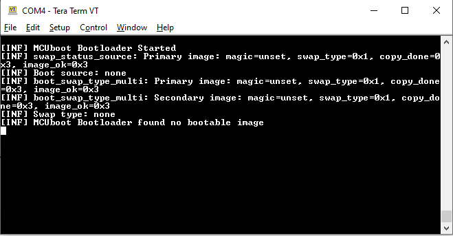

6. Build and program the blinky application in BOOT mode.

   <details open><summary><b>Using CLI</b></summary>

      From the terminal, go to *\<application>/blinky_app* directory and execute the `make program_proj` command to build and program the application using the default toolchain to the selected target. The default `IMG_TYPE` are specified in the file *user_config.mk*, but you can override the `IMG_TYPE` value by executing the below command:

      ```
      make program_proj IMG_TYPE=BOOT
      ```
   </details>
    
    After programming, the bootloader starts automatically and lets CM4 or CM7 core run the blinky application. Confirm that the user LED toggles at a 1-second interval and the UART terminal displays a message as shown in **Figure 2**.

   **Figure 2. Booting with the blinky application in the BOOT mode**

   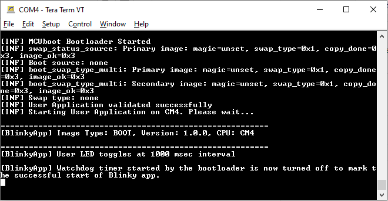

7. Build and program the combined image for bootloader and blinky applications.

   <details open><summary><b>Using Eclipse IDE for ModusToolbox&trade; software</b></summary>

      1. Select the 'bootloader_app' or 'blinky_app' application in the Project Explorer.

      2. Edit the file *user_config.mk* and update the value of the `IMG_TYPE` variable to `BOOT`.

      3. In the **Quick Panel**, scroll down, and click **\<Application Name> Program (KitProg3)**. It programs both 'bootloader_app' and 'blinky_app' applications.

   </details>

   <details open><summary><b>Using CLI</b></summary> 

      From the terminal, go to *\<application>* directory and execute the `make program` command to build and program the application using the default toolchain to the default target.

      ```
      make program IMG_TYPE=BOOT
      ```
   </details>

   <br> After programming, the bootloader starts automatically and lets CM4 or CM7 core run the blinky application. Confirm that the user LED toggles at a 1-second interval and the UART terminal displays a message as shown in **Figure 3**.

   **Figure 3. Booting with the blinky application in the BOOT mode**

   

8. Build (**Do not program**) the blinky application in the UPGRADE mode.

    <details open><summary><b>Using Eclipse IDE for ModusToolbox&trade; software</b></summary>

      1. Select the 'bootloader_app' or 'blinky_app' application in the Project Explorer.

      2. Edit the file *user_config.mk* and update the value of the `IMG_TYPE` variable to `UPGRADE`.

      3. In the **Quick Panel**, scroll down, and click **Build \<Application name>**.
    </details>

    <details open><summary><b>Using CLI</b></summary>

      From the terminal, go to *\<application>/blinky_app* directory and execute the following command to build the application using the default toolchain to the default target:

      ```
      make build_proj -j8 IMG_TYPE=UPGRADE
      ```
    </details>

9. Program the UPGRADE image using CLI or through [CYPRESS&trade; Programmer](https://www.infineon.com/cms/en/design-support/tools/programming-testing/psoc-programming-solutions/).

      <details open><summary><b>Using CLI</b></summary>

      From the terminal, go to *\<application>/blinky_app* directory and execute the following command to program the UPGRADE image using the default toolchain to the default target:

      ```
      make qprogram_proj IMG_TYPE=UPGRADE
      ```

      </details>

      <details open><summary><b>Using CYPRESS&trade; Programmer</b></summary>

      1. Launch **CYPRESS&trade; Programmer** and select the probe or kit that you are using.

      2. Click on the **Open** icon and select the UPGRADE image hex file from *\<application>/blinky_app/build/UPGRADE/APP_< BSP-NAME >/\<Build Config>/blinky_app.hex* directory.

      3. If your UPGRADE image is built for an external flash, select and mark the **External Memory** checkbox.

      4. Click **Connect** and then **Program**.

      </details>

     <br> After programming, the bootloader starts automatically. The bootloader validates the UPGRADE image and upgrades the image by copying the image from the secondary slot to the primary slot. Then the bootloader lets CM4 or CM7 core run the upgraded image in the primary slot.

    1. For Overwrite-based upgrade, Confirm that the user LED toggles approximately at the 250-millisecond interval and the UART terminal displays the message as shown in **Figure 4**.

       **Figure 4. Booting the blinky application in the UPGRADE mode after successful OVERWRITE-based upgrade**

       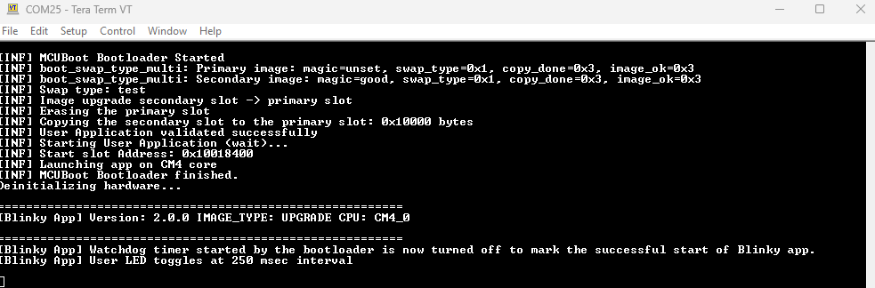

    2. For a swap-based upgrade, To make the UPGRADE image as the permanent primary image, enter 'Y' in the UART terminal. To revert back to the BOOT image, enter 'N' in the UART terminal. Confirm that the user LED toggles approximately at a 250-millisecond interval and the UART terminal displays the message as shown in **Figure 5** and **Figure 6** according to your response. 

       **Figure 5. Booting the blinky application in the UPGRADE mode after successful SWAP-based upgrade with response YES**

       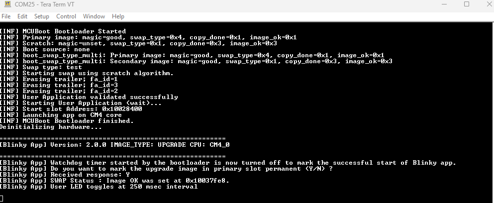

       **Figure 6. Booting the blinky application in the UPGRADE mode after successful SWAP-based upgrade with response NO**

       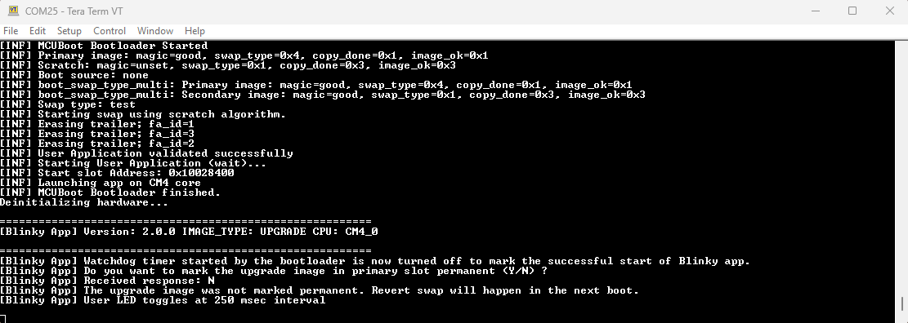

10. In the case of a response of 'Y', confirm that the upgrade image is booted up on the next reset and the UART terminal displays the message as shown in **Figure 7**.

    **Figure 7. After giving response YES**

    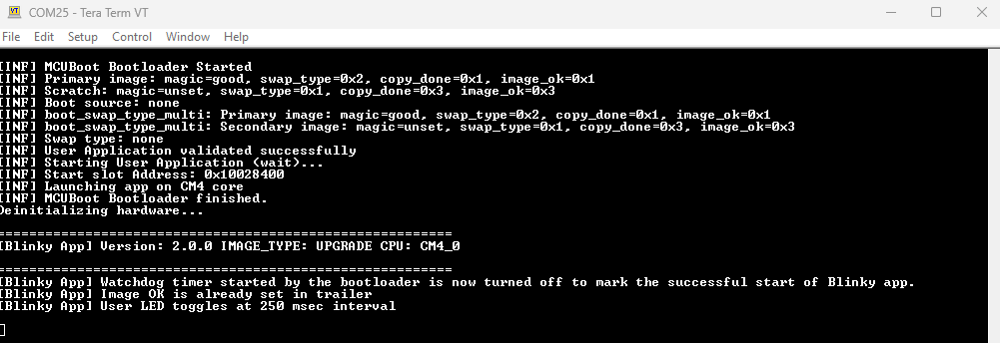

11. In the case of a response of 'N', confirm that it will revert back to the BOOT image on the next reset and the UART terminal displays the message as shown in **Figure 8**.

    **Figure 8. After giving response NO**

    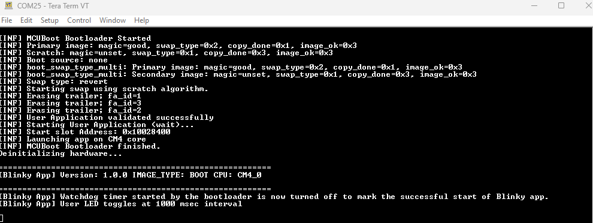

> **NOTE:** You can build the combined image for bootloader and blinky applications using the `make build` CLI command in the *\<application>* directory but during the linking stage there might be an error stating multiple definitions of symbols for blinky applications for `BOOT` and `UPGRADE` image. Currently, the solution to the problem has been addressed in the following code section of the *\<application>/blinky_app/Makefile* which ignores the build artifacts of the other `IMG_TYPE`. Ex: If `BOOT` is selected as `IMG_TYPE` then *\<application>/blinky_app/build/UPGRADE* build directory artifacts will be ignored during the compilation and linking of the `BOOT` image.

      ```
      ifeq ($(IMG_TYPE), BOOT)
      CY_IGNORE+=build/UPGRADE
      else
      ifeq ($(IMG_TYPE), UPGRADE)
      CY_IGNORE+=build/BOOT
      endif
      endif
      ```

For programming the individual builds of the bootloader and blinky app, use the `make program_proj` CLI command as shown in the preceding steps.

## Debugging

You can debug the example to step through the code. 

<details><summary><b>In Eclipse IDE</b></summary>

Use the **\<Application Name> Debug (KitProg3_MiniProg4)** configuration in the **Quick Panel**. For details, see the "Program and debug" section in the [Eclipse IDE for ModusToolbox&trade; user guide](https://www.infineon.com/MTBEclipseIDEUserGuide).
> **Note:** **(Only while debugging)** On the CM4 CPU, some code in `main()` may execute before the debugger halts at the beginning of `main()`. This means that some code executes twice – once before the debugger stops execution, and again after the debugger resets the program counter to the beginning of `main()`. See [KBA231071](https://community.infineon.com/docs/DOC-21143) to learn about this and for the workaround.

</details>

<details><summary><b>In other IDEs</b></summary>
Follow the instructions in your preferred IDE.
</details>


## Design and implementation

### Overview

As explained at the beginning of this README, this example bundles two applications - the bootloader and the blinky applications. The blinky application is directly programmed into the flash (internal or external depending on the build parameters) to quickly evaluate the MCUboot operation.

In a real scenario, an application that can download the UPGRADE image over a wired or wireless communication interface writes the image into the secondary slot and give the control to the bootloader, it will validate and boot the UPGRADE image. For example, [mtb-example-ota-mqtt](https://github.com/Infineon/mtb-example-ota-mqtt) is implemented using the [OTA](https://github.com/Infineon/ota-update) middleware and [mtb-example-xmc7000-otw-firmware-upgrade](https://github.com/Infineon/mtb-example-xmc7000-otw-firmware-upgrade) is implemented using the [DFU](https://github.com/Infineon/dfu) middleware.

The MCUboot repo in [GitHub](https://github.com/mcu-tools/mcuboot/tree/v1.9.1-cypress/boot/cypress) also includes two applications - MCUbootApp and BlinkyApp - for PSoC&trade; 6 and XMC7000 MCU families. The functionality of this code example is the same as those applications. In this example, the bootloader application reuses a lot of source files (see *\<application>/common_libs* for the exact list of files) from the MCUbootApp.

This code example uses ModusToolbox&trade; resources such as BSPs, PSoC&trade; 62 and XMC7200 MCU devices to provide a rich development experience that aligns well with other code examples based on ModusToolbox&trade;. The execution flow of the bootloader application is shown in **Figure 9**.

**Figure 9. Bootloader application flow**

<!-- 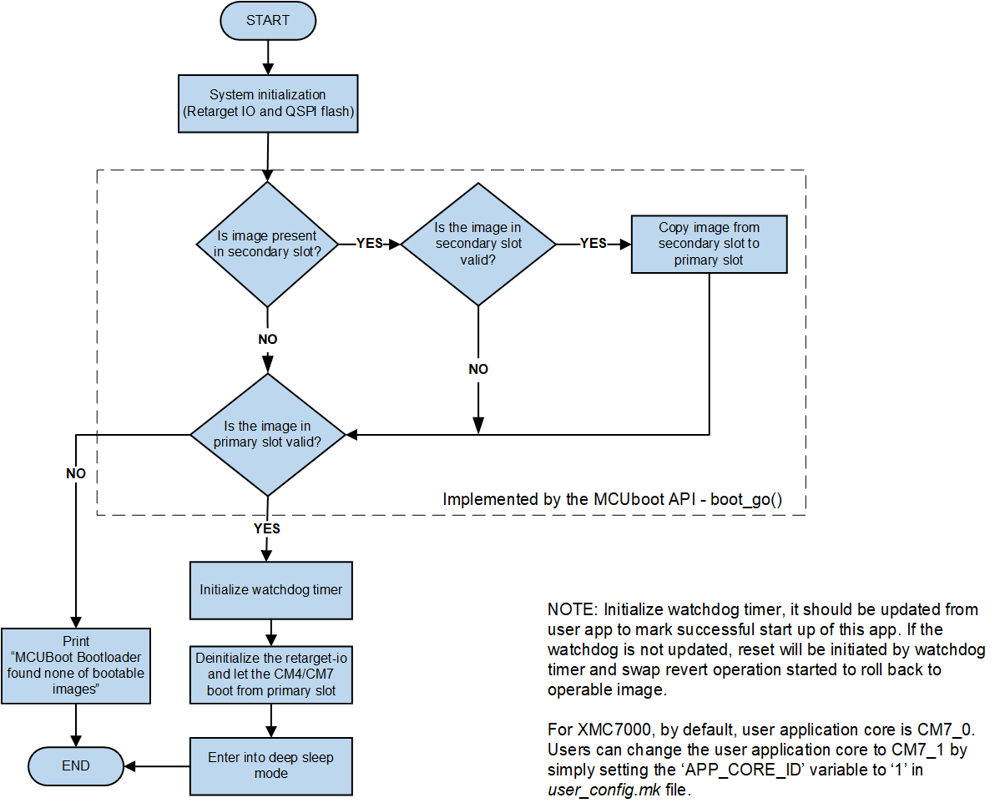-->


### MCUboot basics

[MCUboot](https://github.com/mcu-tools/mcuboot) library helps implement secured bootloader applications for 32-bit MCUs.

MCUboot works by dividing the flash into two slots per image - primary and secondary. The first version of the application is programmed into the primary slot during production. A firmware update application running in the device receives the UPGRADE image over a wired (device-firmware-upgrade or DFU) or wireless (over-the-air or OTA) communication interface and places it in the secondary slot. This slot-based partition helps in read/write-protecting the primary slot from a less-privileged application.

Typically, a bootloader application executes in secured mode and is privileged to access the primary slot while a less-privileged application such as an OTA or DFU applications cannot access the primary slot, but it can access the secondary slot.

MCUboot always boots from the primary slot and copies the image from the secondary slot into the primary slot when an upgrade is requested. The upgrade can be either overwrite-based or swap-based mode. In an overwrite-based upgrade, the image in the primary slot is lost and there is no way to roll back if the new image has an issue. In a swap-based upgrade, the images are swapped between the two slots and rollback is possible. In this case, MCUboot makes use of an additional area in the flash called the *scratch area* for reliable swapping. MCUboot for PSoC&trade; 6 and XMC7000 MCUs supports both swap-based and overwrite-based upgrades.

Each image slot contains the metadata which is used by MCUboot to determine the current state and what actions should be taken during the current boot operation. In the case of a swap-based upgrade, the `img_ok` field is updated by the application to make the current image (UPGRADE image) permanent in the primary slot. See the [image trailer](https://github.com/mcu-tools/mcuboot/blob/v1.9.1-cypress/docs/design.md#image-trailer) for more details.

MCUboot implements a reset recovery and resumes the copy operation if a reset or power failure occurs in the middle. MCUboot also supports multi-image bootloading where several pairs of primary and secondary slots exist. In this case, MCUboot updates each image independently; that is, updates the image in any primary slot using the image from the corresponding secondary slot. However, MCUboot always boots from the primary slot of image 0. The image 0 application once booted can boot other images as required (This code example does not support multi-image configuration at the moment).

#### Overwrite-based upgrade for PSoC&trade; 6 and XMC7000 MCUs

In an overwrite-based upgrade, the secondary image is simply copied to the primary slot after successful validation. There is no way to revert the upgrade if the secondary image is inoperable.

#### Swap-based upgrade for PSoC&trade; 6 and XMC7000 MCUs

In a swap-based upgrade, images in the primary and secondary slots are swapped. The upgrade can be reverted if the secondary image does not confirm its operation.

There are three types of swap modes supported in MCUboot - scratch, move, and using a status partition. Only swap mode using status partition can be used with PSoC&trade; 6 and XMC7000 MCUs because of the hardware restriction of the large minimum flash write/erase size. The MCUboot library is designed with the minimum flash to write/erase size to be 8 bytes or less. This is to ensure that data is not lost when writing to the flash sector status so that it is a single-cycle operation ensuring the robustness of the application.

Because PSoC&trade; 6 and XMC7000 MCUs have a large minimum flash write/erase size, a swap using status partition has been implemented. Using this algorithm, a separate area in the internal flash is used to store swap status values and the image trailer data such as the swap size and info, BOOT image magic value, and the image ok field.

See the "Swap status partition description" section of the [MCUbootApp documentation](https://github.com/mcu-tools/mcuboot/blob/v1.9.1-cypress/boot/cypress/MCUBootApp/MCUBootApp.md).

See [MCUboot design](https://github.com/mcu-tools/mcuboot/blob/v1.9.1-cypress/docs/design.md) documentation for details.

### Memory map/partition

**Figure 10** shows a typical flash map or partition used with MCUboot. The partitions need not be contiguous in the memory because it is possible to configure the offset and size of each partition. However, the offset and the size must be aligned to the boundary of a flash row or sector. For PSoC&trade; 6 and XMC7000 MCUs, the size of a flash row is 512 bytes. Also, the partition can be in either the internal flash or external flash (External flash is not supported for XMC7200 at the moment).

The memory partition is defined through a flash map (a JSON file, see *\<application>/flashmap/* directory for examples). It is important that the bootloader application and the bootable application (i.e., the blinky application in this example) agree on the flash map. This example uses a shared file (*\<application>/user_config.mk*) between the two applications and *memorymap.mk* (autogenerated from the flashmap JSON file) so that they can use the same set of flash map parameters. See Configuring the default flash map for details.

**Figure 10. Typical flash map**

<!--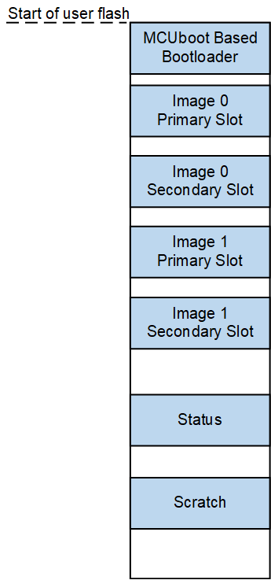-->


#### Sample flash maps

Following images illustrate the flash maps provided in this example. The flashmap JSON files are located in the *\<application>/flashmap/* directory.

**Figure 11. Primary and secondary slots in internal flash for PSoC&trade; 62**

<!--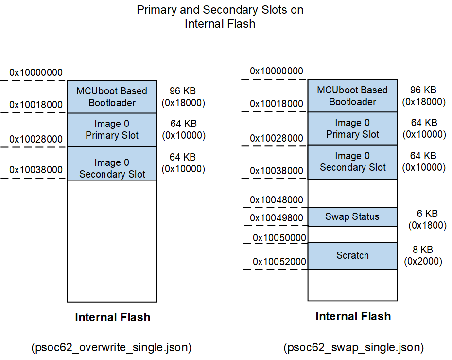-->


**Figure 12. Primary slot in internal and secondary slot in external flash for PSoC&trade; 62**

<!--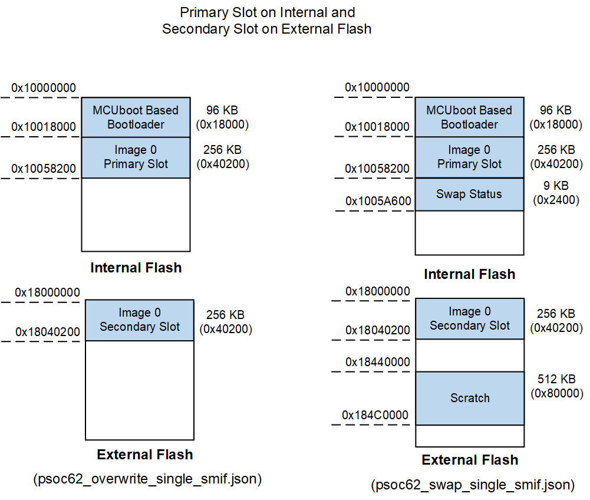-->


**Figure 13. Primary and secondary slots in external flash for PSoC&trade; 62**

<!--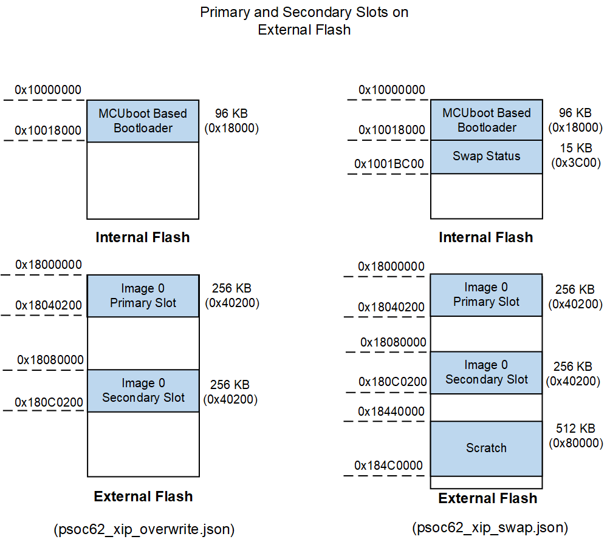-->


**Figure 14. Primary and secondary slots in internal flash for XMC7000**

<!--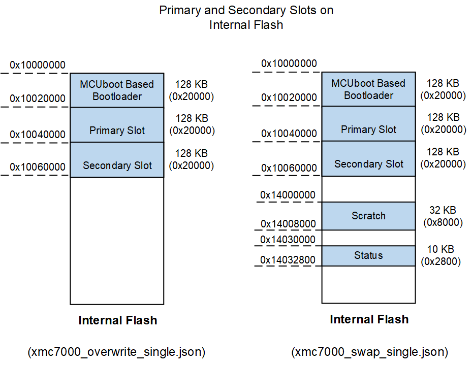-->


### Customizing and selecting the flash map

A flash map, for example is selected by changing the value of the `FLASH_MAP` variable in the *\<application>/user_config.mk* file to the desired JSON file name.

See the [How to modify flash map](https://github.com/mcu-tools/mcuboot/blob/v1.9.1-cypress/boot/cypress/MCUBootApp/MCUBootApp.md#how-to-modify-flash-map) section to understand how to customize the flash map to your needs.

During the pre-build stage, the flashmap JSON file is automatically parsed by the *\<application>/scripts/memorymap_\<family>.py* Python script to generate the following files:

   1. *memorymap.mk*, *memorymap.c* and *memorymap.h* files in the bootloader application.
   2. *memorymap.mk*, *memorymap.c* and *memorymap.h* files in the blinky application.

The parameters generated in the *memorymap.mk* file are used in the `DEFINES` and `LDFLAGS` variables of the application Makefile.

The structures generated in the *memorymap.c* and *memorymap.h* files are used by the *cy_flashmap.c* file in the MCUboot library.

> **Note:** While modifying the flash map, make sure the primary slot, secondary slot, and bootloader application flash sizes are appropriate. In this code example, it will automatically match the application linker scripts flash memory allocation with the *memorymap.c* and *user_config.mk* files.

### Customizing the RAM area of CM0P and CM4 or CM7 applications

Modify the `BOOTLOADER_APP_RAM_SIZE` to change the CM0P core ram size in the *\<application>/user_config.mk* file. The remaining RAM size will be set for CM4 or CM7 core.

> **Note:** If you are customizing your own linker script for CM0P and CM4 or CM7 core, make sure the RAM areas of the CM0P-based bootloader and CM4- or CM7-based user application do not overlap. Memory (stack) corruption of the CM0P application can cause failure if SystemCall-served operations are invoked from CM4 or CM7.

### Configuring make variables

This section explains the important make variables that affect the MCUboot functionality. Some of these variables are autogenerated from the flashmap JSON file and some variables can be updated directly in the Makefile or passed along with the `make build` command.

#### **Common make variables**

These variables are common to both the bootloader and blinky applications, its configured via *\<application>/user_config.mk* file.

**Table 1. Common make variables**

 Variable | Default value | Description
 -------- | ------------- |------------
 `FAMILY`             | Autoselected | Family name.  <br>Valid values: `PSOC6`, `XMC7000`.  <br>**Note:** Currently, in the Makefile, a conditional if-else block is used to automatically select a value based on the selected `TARGET`. You can remove it and directly assign a value according to **Table 4**.
 `FLASH_MAP`             | psoc62_overwrite_single.json or xmc7000_overwrite_single.json | Flashmap JSON file name.  <br>Valid flashmap for XMC7000: `xmc7000_overwrite_single.json`and `xmc7000_swap_single.json`.  <br>Valid flashmap for PSOC6: `psoc62_overwrite_single_smif.json`, `psoc62_overwrite_single.json`,`psoc62_swap_single_smif.json`,`psoc62_swap_single.json`, `psoc62_xip_overwrite.json` and `psoc62_xip_swap.json`.<br> **Note:** XIP mode is not supported for the CYW9P62S1-43012EVB-01 kit.
 `PLATFORM`             | Autoselected | Platform name. <br>Valid values: `PSOC_062_1M`, `PSOC_062_2M`, `PSOC_062_512K` and `XMC7200`.  <br>**Note:** Currently, in the Makefile, a conditional filter block is used to automatically select a value based on the `TARGET` selected. You can remove it and directly assign a value according to **Table 4**.
 `USER_APP_CORE`             | Autoselected | User application core (blinky). <br>Valid values: CM4, CM7. Currently, in the Makefile, a conditional if-else block is used to automatically select a value based on the `FAMILY` selected.
 `SIGN_KEY_FILE`             | cypress-test-ec-p256 | Name of the private and public key files (the same name is used for both keys). |
 `KEY_FILE_PATH` | *\<application>/keys* | Path to the private key file. Used with the *imgtool* for signing the image.
 `USER_APP_CORE_ID`| 0 | Bootloader designed like user application can either run on CM7_0 or CM7_1 cores ( for XMC7200 kit). By default, blinky application run on the CM7_0 core. Can change the core by setting the value to `1`.
 `BOOTLOADER_SIZE`           | Autogenerated       | Flash size of the bootloader application run by CM0P. <br>In the linker script for the bootloader application (CM0P), the `LENGTH` of the `flash` region is set to this value.<br>In the linker script for the blinky application (CM4 or CM7), the `ORIGIN` of the `flash` region is offset to this value.
 `BOOTLOADER_APP_RAM_SIZE`   | 0x20000              | RAM size of the bootloader application run by CM0P. <br>In the linker script for the bootloader application (CM0P), the `LENGTH` of the `ram` region is set to this value.<br/>In the linker script for the blinky application (CM4 or CM7), the `ORIGIN` of the `ram` region is offset to this value, and the `LENGTH` of the `ram` region is calculated based on this value.
 `SLOT_SIZE`                 | Autogenerated       | Size of the primary slot and secondary slot. i.e., the flash size of the blinky application run by CM4 or CM7.
 `MAX_IMG_SECTORS`           | Autogenerated       | Maximum number of flash sectors (or rows) per image slot for which swap status is tracked in the image trailer.
 `MCUBOOT_IMAGE_NUMBER`      | Autogenerated       | The number of images supported in the case of multi-image bootloading.
 `USE_OVERWRITE`              | Autogenerated       | The value is '1' when scratch and status partitions are not defined in the flashmap JSON file.<br> **Note:** These variables are defined in `memorymap.mk` file.
 `USE_EXTERNAL_FLASH`         | Autogenerated       | Value is 1 when an external flash is used for either a primary or secondary slot.
 `USE_XIP`                    | Autogenerated       | Value is 1 when the primary image is placed on external memory.
 `MCUBOOT_HEADER_SIZE`       | 0x400                | Size of the MCUboot header. Must be a multiple of 1024 (see the following note).<br>Used in the following places:<br>1. In the linker script for the blinky application (CM4 or CM7), the starting address of the `.text` section is offset by the MCUboot header size from the `ORIGIN` of the `flash` region. This is to leave space for the header that will be later inserted by the *imgtool* during post-build steps. <br/>2. Passed to the *imgtool* while signing the image. The *imgtool* fills the space of this size with zeroes (or 0xFF depending on internal or external flash) and then adds the actual header from the beginning of the image.

> **Note:** The value of `MCUBOOT_HEADER_SIZE` must be a multiple of 1024 because the CM4 or CM7 image begins immediately after the MCUboot header and it begins with the interrupt vector table. For PSoC&trade; 6 MCU, the starting address of the interrupt vector table must be 1024-bytes aligned.

`Number of bytes to be aligned to = Number of interrupt vectors x 4 bytes`

i.e., 1024 = 256 vectors x 4 bytes (32-bit address) per vector.

PSoC&trade; 6 MCU supports up to 240 external interrupts in addition to the 16 system exceptions provided by CM4. See the description of the CPUSS_CM4_VECTOR_TABLE_BASE register in [PSoC&trade; 6 registers technical reference manual](https://www.infineon.com/dgdl/Infineon-PSoC_6_MCU_PSoC_62_Register_Technical_Reference_Manual-AdditionalTechnicalInformation-v07_00-EN.pdf?fileId=8ac78c8c7d0d8da4017d0f9480c901dd) and the description of the Vector Table Offset register (VTOR) in Cortex&reg;-M4 (ARMv7-M) architecture technical reference manual for details.


#### **Bootloader application make variables**

These variables are configured via *\<application>/user_config.mk*.

**Table 2. Bootloader application make variables**

 Variable             | Default value | Description
 -------------------- | ------------- | ----------------
 `USE_SW_DOWNGRADE_PREV`        | 1       | Downgrade prevention, Value is '1' to avoid older firmware versions for upgrade.
 `USE_BOOTSTRAP`        | 1       | When set to '1' and the Swap mode is enabled, the application in the secondary slot will overwrite the primary slot if the primary slot application is invalid.
 `MCUBOOT_LOG_LEVEL` | MCUBOOT_LOG_LEVEL_INFO | Global logging level configuration variable for bootloader application. <br>Valid values: `MCUBOOT_LOG_LEVEL_OFF`, `MCUBOOT_LOG_LEVEL_ERROR`,`MCUBOOT_LOG_LEVEL_WARNING`, `MCUBOOT_LOG_LEVEL_OFF` and `MCUBOOT_LOG_LEVEL_DEBUG`.<br> **Note:** This variable is configured via *\<application>/bootloader_app/Makefile*.


<br>

#### **Blinky application make variables**

These variables are configured via *\<application>/user_config.mk*.

**Table 3. Blinky application make variables**

 Variable       | Default value    | Description
 -------------- | -----------------| -------------
 `IMG_TYPE`        | BOOT   | Valid values: BOOT, UPGRADE<br>**BOOT:** Use when the image is built for the primary slot. The `--pad` argument is not passed to the *imgtool*. <br/>**UPGRADE:** Use when the image is built for the secondary slot.  The `--pad` argument is passed to the *imgtool*.<br>Also, the blinky application defines the LED toggle delay differently depending on whether the image is BOOT type or UPGRADE type.
 `PRIMARY_IMG_START`         | Autogenerated       | Starting address of primary slot.
 `SECONDARY_IMG_START`        | Autogenerated       | Starting address of secondary slot.
 `HEADER_OFFSET`   | Auto-calculated | The starting address of the CM4 or CM7 application or the offset at which the header of an image will begin. Value equal to (`SECONDARY_IMG_START` - `PRIMARY_IMG_START`).
 `APP_VERSION_MAJOR`<br>`APP_VERSION_MINOR`<br>`APP_VERSION_BUILD` | 1.0.0 if `IMG_TYPE=BOOT`<br>2.0.0 if `IMG_TYPE=UPGRADE` | Passed to the *imgtool* with the `-v` option in *MAJOR.MINOR.BUILD* format, while signing the image. Also available as macros to the application with the same names.<br> **Note:** These variables are configured via *\<application>/blinky_app/Makefile*.

<br>

**Table 4. Family and platform names for the respective kits**

Kit | Family | Platform
:-------- | :-------------    | :------------
CY8CPROTO-062S2-43439 <br>CY8CPROTO-062-4343W <br>CY8CKIT-062S2-43012 <br>CY8CEVAL-062S2 <br>CY8CEVAL-062S2-LAI-4373M2 <br>CY8CEVAL-062S2-LAI-43439M2 <br>CY8CEVAL-062S2-MUR-43439M2 <br>CY8CEVAL-062S2-MUR-4373EM2 <br>CY8CEVAL-062S2-MUR-4373M2 <br>CY8CEVAL-062S2-CYW43022CUB | PSOC6 | PSOC_062_2M
CY8CKIT-062-WIFI-BT <br>CY8CKIT-062-BLE <br>CYW9P62S1-43438EVB-01 <br>CYW9P62S1-43012EVB-01 <br> | PSOC6 | PSOC_062_1M
CY8CPROTO-062S3-4343W | PSOC6 | PSOC_062_512K
KIT_XMC72_EVK <br>KIT_XMC72_EVK_MUR_43439M2 | XMC7000 | XMC7200

<br>

### Usage of external flash

This section provides a quick overview of the external flash support with MCUboot for PSoC&trade; 6 MCU. External flash support refers to placing the primary/secondary/both slots into an external flash. This helps to increase the available internal flash for the primary slot or to support update operations on MCUs with lower internal flash sizes.

MCUboot accesses the external NOR flash using the serial memory interface (SMIF) aka 'QSPI peripheral block' in PSoC&trade; 6 MCU. The SMIF block supports interfacing with QSPI devices; most of the PSoC&trade; 6 MCU development kits include a QSPI NOR flash. For example, the CY8CPROTO-062S2-43439 kit includes the [S25FL512S](https://www.infineon.com/dgdl/Infineon-S25FL512S_512_Mb_%2864_MB%29_3.0_V_SPI_Flash_Memory-DataSheet-v19_00-EN.pdf?fileId=8ac78c8c7d0d8da4017d0ed046ae4b53), which is a 64 MB (512-Mbit) QSPI NOR flash. MCUboot for PSoC&trade; 6 MCU uses the Serial Flash Discoverable Parameter (SFDP) standard to auto-discover the flash read/write commands and other parameters. Ensure that the NOR flash on your board supports this standard. See [ExternalMemory.md](https://github.com/mcu-tools/mcuboot/tree/v1.9.1-cypress/boot/cypress/MCUBootApp/ExternalMemory.md) for more information on working with the external flash.

During post-build steps, the image address is relocated to begin from the external flash address using the following command:

```
arm-none-eabi-objcopy --change-addresses=HEADER_OFFSET -O ihex <input.elf> <output.hex>
```

> **Note:** If you are placing more than one image in the external flash, ensure that the starting address of the images is aligned to the erase sector size of the NOR flash. For S25FL512S, the erase sector size is 256 KB (0x40000).

> **Note:** In this code example, external flash is not supported for XMC7200 device at the moment.

### External flash programming

The programmer tool for PSoC&trade; 6 MCU (based on OpenOCD) programs the external flash with the data from the HEX file when the address of the data is 0x18000000 or higher. The programmer tool requires the configuration information (e.g., erase/read/program commands) of the external flash present on the board to be able to program the flash. This configuration is placed into the user area of the internal flash, and the address pointing to the configuration is placed into the TOC2 section of the supervisory flash (SFlash) area of the internal flash. The programmer tool understands the TOC2 structure and knows where to look for the address that points to the external flash configuration. See [PSoC&trade; 6 MCU programming specifications](https://www.infineon.com/dgdl/Infineon-PSoC_6_Programming_Specifications-Programming+Specifications-v12_00-EN.pdf?fileId=8ac78c8c7d0d8da4017d0f66d9bf5627) for more information on SFlash and TOC2.

The *\<mtb_shared>/mcuboot/\<tag>/boot/cypress/MCUBootApp/cy_serial_flash_prog.c* file defines the TOC2 structure and the *cycfg_qspi_memslot.c./h* files under *bsps/TARGET_APP_< BSP-NAME >/config/GeneratedSource* hold the external flash configuration structures. These files are autogenerated from *design.cyqspi* under *bsps/TARGET_APP_< BSP-NAME >/config* using the [QSPI configurator](https://www.infineon.com/dgdl/Infineon-ModusToolbox_QSPI_Configurator_4.0_User_Guide-UserManual-v01_00-EN.pdf?fileId=8ac78c8c8386267f0183a960a2bf5986) tool.

> **Note:** Although the bootloader application uses SFDP to auto-discover the external flash configuration, a static configuration must be present in the internal flash for programming to work. It is possible to program without storing the configuration in the internal flash. However, in that case, external memory programming is limited only to the PSoC&trade; 6 MCU + NOR flash device combinations that are on the PSoC&trade; 6 MCU development kits.

### Security

> **Note:** This example simply demonstrates the image-signing feature of MCUboot. It does not implement root of trust (RoT)-based secured services such as secured boot and secured storage (to securely store and retrieve the keys). You must ensure that adequate security measures are implemented in your end product. See the [PSoC&trade; 64 line of secured MCUs](https://www.infineon.com/cms/en/product/microcontroller/32-bit-psoc-arm-cortex-microcontroller/psoc-6-32-bit-arm-cortex-m4-mcu/psoc-64) that offer those advanced security built-in features, and read this [whitepaper](https://www.infineon.com/dgdlac/Infineon-Security_Comparison_Between_PSoC_64_Secure_MCU_and_PSoC_62_63_MCU-Whitepaper-v01_00-EN.pdf?fileId=8ac78c8c7d0d8da4017d0fb27691270a) that compares the security features between PSoC&trade; 64 'secure' MCU and PSoC&trade; 62/63 MCUs.

MCUboot checks the image integrity with SHA256, and image authenticity with digital signature verification. Multiple signature algorithms are supported; this example enables ECDSA SECP256R1 (EC256) by default. MCUboot uses the `Mbed TLS` library for cryptography.

PSoC&trade; 6 MCU supports hardware-accelerated cryptography based on the `Mbed TLS` library via a shim layer. The  [cy-mbedtls-acceleration](https://github.com/Infineon/cy-mbedtls-acceleration) library implements this layer. Hardware-accelerated cryptography shortens the boot time by more than four times compared to the software implementation (observation results).

> **Note:** In this code example, encryption image and hardware crypto acceleration are not supported at the moment.

MCUboot verifies the signature of the image in the primary slot every time before booting when `MCUBOOT_VALIDATE_PRIMARY_SLOT` is defined. In addition, it verifies the signature of the image in the secondary slot before copying it to the primary slot.

This example enables image authentication by uncommenting the following lines in the *\<application>/bootloader_app/libs/mcuboot/boot/cypress/MCUbootApp/config/mcuboot_config/mcuboot_config.h* file:

```
#define MCUBOOT_SIGN_EC256
#define NUM_ECC_BYTES (256 / 8)
.
.
.
#define MCUBOOT_VALIDATE_PRIMARY_SLOT
```

When these options are enabled, the public key is embedded within the bootloader application. The blinky application is signed using the private key during the post-build steps. For PSoC&trade; 6 devices, *imgtool* Python module included in the MCUboot repository is used for signing the image. For XMC7000 device, python module *cysecuretools* is used for signing the image.

This example includes a sample key pair under the *\<application>/keys* directory. **You must not use this key pair in your end product.** See [Generating a key pair](#generating-a-key-pair) for generating a new key pair.

### Generating a key pair

#### Python command to generate permanent and public keys for user application authentication

You can use the *imgtool* Python module to generate the keys.

1. Generate the private key:

   ```
   python $(IMGTOOL_PATH)/imgtool.py keygen -k <application>/keys/cypress-test-ec-p256.pem -t ecdsa-p256 
   ```

2. Generate the public key:

   ```
   python $(IMGTOOL_PATH)/imgtool.py getpub -k <application>/keys/cypress-test-ec-p256.pem > <application>/keys/cypress-test-ec-p256.pub
   ```

### Pre- and post-build steps

#### Bootloader app: Pre-build steps

The pre-build steps are specified through the `PREBUILD` variable in *bootloader_app/Makefile*.

1. Generate memorymap source and `memorymap.mk` files from flashmap JSON file.

2. Initialize the Git submodules for MCUboot: This is required because the _library manager updates_ currently do not support initializing Git submodules while cloning a repo. This step executes only if the *libs/mcuboot/ext/mbedtls* directory (a submodule) does not exist or if the content of the directory is empty.

#### Blinky app: Pre-build steps

The pre-build steps are specified through the `PREBUILD` variable in *blinky_app/Makefile*.

- Generate memorymap source and `memorymap.mk` files from flashmap JSON file.

   > **Note:** Initially the customized linker file such as - *linker.ld* are present in the folder *\<application>/templates/TARGET_< BSP-NAME >/COMPONENT_CM0P/TOOLCHAIN_GCC_ARM* and are copied automatically from this folder to *bsps/TARGET_APP_< BSP-NAME >/COMPONENT_CM0P/TOOLCHAIN_GCC_ARM* during the BSP update. The build system reads the linker file from the *\<application>/bsps/TARGET_APP_< BSP-NAME >/COMPONENT_CM0P/TOOLCHAIN_GCC_ARM*. CM4 or CM7 application linker file as well copied from the template folder to the bsp folder during the BSP update.

#### Blinky app: Post-build steps

The post-build steps are specified through the `POSTBUILD` variable in *\<application>/blinky_app/Makefile*. These steps generate the signed version of the image in HEX format using the *imgtool* or *cysecuretools* Python module. The `SIGN_ARGS` variable holds the arguments passed to the *imgtool* or *cysecuretools*. The final image is in HEX format so that PSoC&trade; 6 MCU programmer tools can directly program the image into the device. If you are generating the image to use with a firmware update application running on the device, you may need to convert the image into binary (BIN) format.

1. Make a copy of the *\*.hex* file into a *\*_raw.hex* file.

2. Delete the *\*.hex* file because the final signed image will be generated with the same filename so that you can directly program the file either using the `make program_proj` command or using the launch configurations in the Eclipse IDE for ModusToolbox&trade; software.

3. Relocate the address and generate a new *\*_unsigned.hex* file from the *\*.elf* file using the *arm-none-eabi-objcopy* tool.

4. Sign the image using *imgtool* or *cysecuretools* and generate the *\*.hex* file.

> **Note:** For PSoC&trade; 6 devices, python module *imgtool* is used for signing the image. For XMC7000 device, python module *cysecuretools* is used for signing the image

### Design notes

1. Both the bootloader application and the blinky application implement redirecting printf to the serial port (UART). Both applications use the same SCB (UART) block to communicate with the USB-to-UART bridge provided by KitProg3. The bootloader application runs first, initializes the UART block, prints the messages, and then boots the blinky application which then again initializes the same UART block and prints messages. There is no conflict currently because the applications do not print simultaneously.

2. The XMC7000 is a multi-core device, this code example is designed to run the bootloader on the CM0P core and blinky application on the CM7_0 or CM7_1 core by simply changing the variable `USER_APP_CORE_ID`. The bootloader on CM0P will always check for a valid application binary. On every power cycle, transfer control to the CM7_0 or CM7_1 core to execute the blinky application.

3. PSoC&trade; 6 is a dual-core device, this code example is designed to run the bootloader on the CM0P core and blinky application on the CM4_0. The bootloader on CM0P will always check for a valid application binary. On every power cycle, transfer control to the CM4_0 core to execute the blinky application. So variable `USER_APP_CORE_ID` should be always '0'.

## Resources and settings

**Table 5. Bootloader app**

Resource  |  Alias/object     |    Purpose
:-------- | :-------------    | :------------
UART (HAL)|cy_retarget_io_uart_obj| UART HAL object used by Retarget-IO for the Debug UART port
SMIF      | QSPIPort | Used for interfacing with QSPI NOR flash.

<br>

**Table 6. Blinky app**

Resource  |  Alias/object     |    Purpose
:-------- | :-------------    | :------------
UART (HAL)|cy_retarget_io_uart_obj| UART HAL object used by Retarget-IO for the Debug UART port
GPIO (HAL)    | CYBSP_USER_LED         | User LED
<br>

### Folder structure

This application has a different folder structure because it contains the firmware for CM0P and CM4 or CM7 applications as follows:
```
|-- <application>                   # Application directory
    |-- bootloader_app/             # CM0P application folder
        |-- deps/                   # Contains application dependence middleware links
        |-- source/                 # Contains source file
        |-- Makefile                # Top-level CM0P application Makefile
    |-- blinky_app/                 # CM4 or CM7 application folder
        |-- deps/                   # Contains application dependence middleware links
        |-- source/                 # Contains source files
        |-- Makefile                # Top-level CM4 or CM7 application Makefile
    |-- flashmap/                   # Contains flashmap json files
    |-- keys/                       # Contains keys for bootloader and user application authentication
    |-- scripts/                    # Contains scripts to generate the memorymap source files and Makefile
    |-- templates/                  # Contains modified linker script for our project
    |-- common_libs.mk              # Configuration file for adding MCUBOOT middleware source files
    |-- common_app.mk               # Common application Makefile
    |-- common.mk                   # Common Makefile
    |-- Makefile                    # Top-level application Makefile
    |-- user_config.mk              # User configuration Makefile

```

## Related resources

Resources  | Links
-----------|----------------------------------
Application notes  | [AN228571](https://www.infineon.com/AN228571) – Getting started with PSoC&trade; 6 MCU on ModusToolbox&trade; <br>  [AN215656](https://www.infineon.com/AN215656) – PSoC&trade; 6 MCU: Dual-CPU system design <br>[AN234334](https://www.infineon.com/dgdl/Infineon-AN234334_Getting_started_with_XMC7000_MCU_on_ModusToolbox_software-ApplicationNotes-v01_00-EN.pdf?fileId=8ac78c8c8412f8d301842d32c5765bfd) – Getting started with XMC7000 MCU on ModusToolbox&trade; software <br> [AN234023](https://www.infineon.com/dgdl/Infineon-AN234023-Smart_IO_usage_setup_in_XMC7000_family-ApplicationNotes-v01_00-EN.pdf?fileId=8ac78c8c8412f8d301845123d1704f20) – Smart I/O usage setup in XMC7000 family 
Code examples  | [Using ModusToolbox&trade;](https://github.com/Infineon/Code-Examples-for-ModusToolbox-Software) on GitHub
Device documentation | [PSoC&trade; 6 MCU datasheets](https://documentation.infineon.com/html/psoc6/bnm1651211483724.html) <br> [PSoC&trade; 6 technical reference manuals](https://documentation.infineon.com/html/psoc6/zrs1651212645947.html)<br>[XMC7000 MCU datasheets](https://www.infineon.com/cms/en/product/microcontroller/32-bit-industrial-microcontroller-based-on-arm-cortex-m/) <br> [XMC7000 technical reference manuals](https://www.infineon.com/cms/en/product/microcontroller/32-bit-industrial-microcontroller-based-on-arm-cortex-m/)
Development kits | Select your kits from the [Evaluation board finder](https://www.infineon.com/cms/en/design-support/finder-selection-tools/product-finder/evaluation-board)<br>[XMC&trade; eval boards](https://www.infineon.com/cms/en/product/microcontroller/32-bit-industrial-microcontroller-based-on-arm-cortex-m/#boards)
Libraries on GitHub  | [mtb-pdl-cat1](https://github.com/Infineon/mtb-pdl-cat1) – PSoC&trade; 6 Peripheral Driver Library (PDL)  <br> [mtb-hal-cat1](https://github.com/Infineon/mtb-hal-cat1) – Hardware Abstraction Layer (HAL) library <br> [retarget-io](https://github.com/Infineon/retarget-io) – Utility library to retarget STDIO messages to a UART port   | [capsense](https://github.com/Infineon/capsense) – CAPSENSE&trade; library and documents <br> [psoc6-middleware](https://github.com/Infineon/modustoolbox-software#psoc-6-middleware-libraries) – Links to all PSoC&trade; 6 MCU middleware<br>[mcu-middleware](https://github.com/Infineon/modustoolbox-software) – Links to all MCU middleware <br> [MCUboot](https://github.com/mcu-tools/mcuboot) – Open-source library enabling the development of secure bootloader applications for 32-bit MCUs <br> [retarget-io](https://github.com/Infineon/retarget-io) – Utility library to retarget STDIO messages to a UART port
Tools  | [ModusToolbox&trade;](https://www.infineon.com/modustoolbox) – ModusToolbox&trade; software is a collection of easy-to-use libraries and tools enabling rapid development with Infineon MCUs for applications ranging from wireless and cloud-connected systems, edge AI/ML, embedded sense and control, to wired USB connectivity using PSoC&trade; Industrial/IoT MCUs, AIROC&trade; Wi-Fi and Bluetooth&reg; connectivity devices, XMC&trade; Industrial MCUs, and EZ-USB&trade;/EZ-PD&trade; wired connectivity controllers. ModusToolbox&trade; incorporates a comprehensive set of BSPs, HAL, libraries, configuration tools, and provides support for industry-standard IDEs to fast-track your embedded application development.

<br>

## Other resources

Infineon provides a wealth of data at [www.infineon.com](https://www.infineon.com) to help you select the right device, and quickly and effectively integrate it into your design.

For XMC&trade; MCU devices, see [32-bit XMC™ Industrial microcontroller based on Arm&reg; Cortex&reg;-M](https://www.infineon.com/cms/en/product/microcontroller/32-bit-industrial-microcontroller-based-on-arm-cortex-m/).


## Document history

Document title: *CE230650* – *MCUboot-based basic bootloader*

 Version | Description of change
 ------- | ---------------------
 1.0.0   | New code example
 2.0.0   | Major update to support ModusToolbox&trade; software v2.2, added support for new kits.<br> This version is not backward compatible with ModusToolbox&trade; software v2.1
 2.1.0   | Added support for new kits
 3.0.0   | Update to support ModusToolbox&trade; software v2.4 and updated to BSP v3.X<br> Added support for CYW9P62S1-43012EVB-01 and CY8CEVAL-062S2-MUR-43439M2 kits.
 4.0.0   | Update to support MCUboot v1.8.1 changes<br>Swap operation support on all targets<br>XIP operation on all targets supporting external flash.
 5.0.0   | Major update to support ModusToolbox™ v3.0. <br> This version is not backward compatible with previous versions of ModusToolbox&trade; software.
 5.1.0   | Minor updates to README
 6.0.0   | Update to support MCUboot v1.8.3 changes
 6.1.0   | Updated to support ModusToolbox&trade; v3.1 and added support for CY8CEVAL-062S2-MUR-4373M2 and CY8CEVAL-062S2-MUR-4373EM2
 6.2.0   | Updated to support ModusToolbox&trade; v3.2
 7.0.0   | Updated to support MCUboot middleware v1.9.1<br> Added support for KIT_XMC72_EVK, KIT_XMC72_EVK_MUR_43439M2, CY8CEVAL-062S2-LAI-43439M2, CY8CEVAL-062S2-CYW43022CUB and CY8CPROTO-062S2-43439 kits.
 7.1.0   | Added support for CY8CEVAL-062S2-CYW955513SDM2WLIPA
<br>


All referenced product or service names and trademarks are the property of their respective owners.

The Bluetooth&reg; word mark and logos are registered trademarks owned by Bluetooth SIG, Inc., and any use of such marks by Infineon is under license.


---------------------------------------------------------

© Cypress Semiconductor Corporation, 2020-2024. This document is the property of Cypress Semiconductor Corporation, an Infineon Technologies company, and its affiliates ("Cypress").  This document, including any software or firmware included or referenced in this document ("Software"), is owned by Cypress under the intellectual property laws and treaties of the United States and other countries worldwide.  Cypress reserves all rights under such laws and treaties and does not, except as specifically stated in this paragraph, grant any license under its patents, copyrights, trademarks, or other intellectual property rights.  If the Software is not accompanied by a license agreement and you do not otherwise have a written agreement with Cypress governing the use of the Software, then Cypress hereby grants you a personal, non-exclusive, nontransferable license (without the right to sublicense) (1) under its copyright rights in the Software (a) for Software provided in source code form, to modify and reproduce the Software solely for use with Cypress hardware products, only internally within your organization, and (b) to distribute the Software in binary code form externally to end users (either directly or indirectly through resellers and distributors), solely for use on Cypress hardware product units, and (2) under those claims of Cypress's patents that are infringed by the Software (as provided by Cypress, unmodified) to make, use, distribute, and import the Software solely for use with Cypress hardware products.  Any other use, reproduction, modification, translation, or compilation of the Software is prohibited.
<br>
TO THE EXTENT PERMITTED BY APPLICABLE LAW, CYPRESS MAKES NO WARRANTY OF ANY KIND, EXPRESS OR IMPLIED, WITH REGARD TO THIS DOCUMENT OR ANY SOFTWARE OR ACCOMPANYING HARDWARE, INCLUDING, BUT NOT LIMITED TO, THE IMPLIED WARRANTIES OF MERCHANTABILITY AND FITNESS FOR A PARTICULAR PURPOSE.  No computing device can be absolutely secure.  Therefore, despite security measures implemented in Cypress hardware or software products, Cypress shall have no liability arising out of any security breach, such as unauthorized access to or use of a Cypress product. CYPRESS DOES NOT REPRESENT, WARRANT, OR GUARANTEE THAT CYPRESS PRODUCTS, OR SYSTEMS CREATED USING CYPRESS PRODUCTS, WILL BE FREE FROM CORRUPTION, ATTACK, VIRUSES, INTERFERENCE, HACKING, DATA LOSS OR THEFT, OR OTHER SECURITY INTRUSION (collectively, "Security Breach").  Cypress disclaims any liability relating to any Security Breach, and you shall and hereby do release Cypress from any claim, damage, or other liability arising from any Security Breach.  In addition, the products described in these materials may contain design defects or errors known as errata which may cause the product to deviate from published specifications. To the extent permitted by applicable law, Cypress reserves the right to make changes to this document without further notice. Cypress does not assume any liability arising out of the application or use of any product or circuit described in this document. Any information provided in this document, including any sample design information or programming code, is provided only for reference purposes.  It is the responsibility of the user of this document to properly design, program, and test the functionality and safety of any application made of this information and any resulting product.  "High-Risk Device" means any device or system whose failure could cause personal injury, death, or property damage.  Examples of High-Risk Devices are weapons, nuclear installations, surgical implants, and other medical devices.  "Critical Component" means any component of a High-Risk Device whose failure to perform can be reasonably expected to cause, directly or indirectly, the failure of the High-Risk Device, or to affect its safety or effectiveness.  Cypress is not liable, in whole or in part, and you shall and hereby do release Cypress from any claim, damage, or other liability arising from any use of a Cypress product as a Critical Component in a High-Risk Device. You shall indemnify and hold Cypress, including its affiliates, and its directors, officers, employees, agents, distributors, and assigns harmless from and against all claims, costs, damages, and expenses, arising out of any claim, including claims for product liability, personal injury or death, or property damage arising from any use of a Cypress product as a Critical Component in a High-Risk Device. Cypress products are not intended or authorized for use as a Critical Component in any High-Risk Device except to the limited extent that (i) Cypress's published data sheet for the product explicitly states Cypress has qualified the product for use in a specific High-Risk Device, or (ii) Cypress has given you advance written authorization to use the product as a Critical Component in the specific High-Risk Device and you have signed a separate indemnification agreement.
<br>
Cypress, the Cypress logo, and combinations thereof, ModusToolbox, PSoC, CAPSENSE, EZ-USB, F-RAM, and TRAVEO are trademarks or registered trademarks of Cypress or a subsidiary of Cypress in the United States or in other countries. For a more complete list of Cypress trademarks, visit [www.infineon.com](https://www.infineon.com). Other names and brands may be claimed as property of their respective owners.
