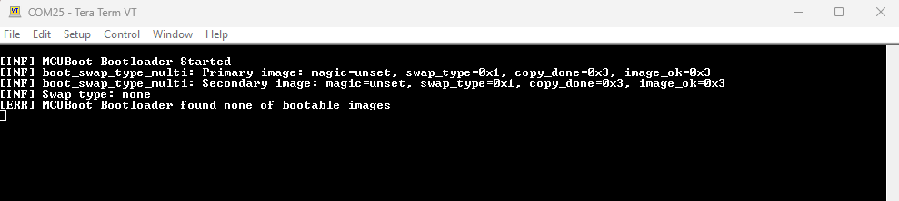

# PSoC&trade; 6 MCU: MCUboot-based basic bootloader

[MCUboot](https://github.com/mcu-tools/mcuboot) is an open-source library enabling the development of secure bootloader applications for 32-bit MCUs. MCUboot is the primary bootloader in popular IoT operating systems such as Zephyr and Apache Mynewt. This example demonstrates using MCUboot with PSoC&trade; 6 MCUs, specifically the PSoC™ 62/63 MCU families. This example bundles two applications:

- **Bootloader app:** Implements an MCUboot-based basic bootloader application run by CM0+. The bootloader handles image authentication and upgrades. When the image is valid, the bootloader lets the CM4 CPU boot/run the image by passing the starting address of the image to it.

- **Blinky app:** Implements a simple LED blinky application run by CM4. You can build this application in one of the following ways. The application toggles the user LED at different rates depending on whether it was built in BOOT mode or UPGRADE mode.

   - **BOOT mode:** The application image is built to be programmed into the primary slot. The bootloader will simply boot the application on the next reset.

   - **UPGRADE mode:** The application image is built to be programmed into the secondary slot. Based on user input bootloader will copy the image into the primary slot and boot it on the next reset.

[View this README on GitHub.](https://github.com/Infineon/mtb-example-psoc6-mcuboot-basic)

[Provide feedback on this code example.](https://cypress.co1.qualtrics.com/jfe/form/SV_1NTns53sK2yiljn?Q_EED=eyJVbmlxdWUgRG9jIElkIjoiQ0UyMzA2NTAiLCJTcGVjIE51bWJlciI6IjAwMi0zMDY1MCIsIkRvYyBUaXRsZSI6IlBTb0MmdHJhZGU7IDYgTUNVOiBNQ1Vib290LWJhc2VkIGJhc2ljIGJvb3Rsb2FkZXIiLCJyaWQiOiJ2YWlyIiwiRG9jIHZlcnNpb24iOiIzLjAuMCIsIkRvYyBMYW5ndWFnZSI6IkVuZ2xpc2giLCJEb2MgRGl2aXNpb24iOiJNQ0QiLCJEb2MgQlUiOiJJQ1ciLCJEb2MgRmFtaWx5IjoiUFNPQyJ9)

## Requirements

- [ModusToolbox&trade; software](https://www.cypress.com/products/modustoolbox-software-environment) v2.4 or later.
- Board support package (BSP) minimum required version: 3.0.0
- Programming language: C
- Associated parts: All [PSoC&trade; 6 MCU](http://www.cypress.com/PSoC6) parts


## Supported toolchains (make variable 'TOOLCHAIN')

- GNU Arm® embedded compiler v10.3.1 (`GCC_ARM`) - Default value of `TOOLCHAIN`


## Supported kits (make variable 'TARGET')

- [PSoC&trade; 6 Wi-Fi Bluetooth&reg; prototyping kit](https://www.cypress.com/CY8CPROTO-062-4343W) (`CY8CPROTO-062-4343W`) - Default value of `TARGET`
- [PSoC&trade; 6 Wi-Fi Bluetooth&reg; pioneer kit](https://www.cypress.com/CY8CKIT-062-WiFi-BT) (`CY8CKIT-062-WIFI-BT`)
- [PSoC&trade; 6 Bluetooth&reg; LE pioneer kit](https://www.cypress.com/CY8CKIT-062-BLE) (`CY8CKIT-062-BLE`)
- [PSoC&trade; 62S3 Wi-Fi Bluetooth&reg; prototyping kit](https://www.cypress.com/CY8CPROTO-062S3-4343W) (`CY8CPROTO-062S3-4343W`)
- [PSoC&trade; 6 Bluetooth&reg; LE prototyping kit](https://www.cypress.com/CY8CPROTO-063-BLE) (`CY8CPROTO-063-BLE`)
- [PSoC&trade; 62S2 Wi-Fi Bluetooth&reg; pioneer kit](https://www.cypress.com/CY8CKIT-062S2-43012) (`CY8CKIT-062S2-43012`)
- [PSoC&trade; 62S1 Wi-Fi Bluetooth&reg; pioneer kit](https://www.cypress.com/CYW9P62S1-43438EVB-01) (`CYW9P62S1-43438EVB-01`)
- [PSoC&trade; 62S1 Wi-Fi Bluetooth&reg; pioneer kit](https://www.cypress.com/CYW9P62S1-43012EVB-01) (`CYW9P62S1-43012EVB-01`)
- [PSoC&trade; 62S2 evaluation kit](https://www.cypress.com/CY8CEVAL-062S2) (`CY8CEVAL-062S2`, `CY8CEVAL-062S2-LAI-4373M2`, `CY8CEVAL-062S2-MUR-43439M2`)

## Hardware setup

This example uses the board's default configuration. See the kit user guide to ensure that the board is configured correctly.

## Software setup

1. Install a terminal emulator if you don't have one. Instructions in this document use [Tera Term](https://ttssh2.osdn.jp/index.html.en).

2. Install a Python interpreter. This code example is tested with [Python 3.8.3](https://www.python.org/downloads/release/python-383/).

## Using the code example

Create the project and open it using one of the following:

<details><summary><b>In Eclipse IDE for ModusToolbox&trade; software</b></summary>

1. Click the **New Application** link in the **Quick Panel** (or, use **File** > **New** > **ModusToolbox&trade; Application**). This launches the [Project Creator](https://www.cypress.com/ModusToolboxProjectCreator) tool.

2. Pick a kit supported by the code example from the list shown in the **Project Creator - Choose Board Support Package (BSP)** dialog.

   When you select a supported kit, the example is reconfigured automatically to work with the kit. To work with a different supported kit later, use the [Library Manager](https://www.cypress.com/ModusToolboxLibraryManager) to choose the BSP for the supported kit. You can use the Library Manager to select or update the BSP and firmware libraries used in this application. To access the Library Manager, click the link from the **Quick Panel**.

   You can also just start the application creation process again and select a different kit.

   If you want to use the application for a kit not listed here, you may need to update the source files. If the kit does not have the required resources, the application may not work.

3. In the **Project Creator - Select Application** dialog, choose the example by enabling the checkbox.

4. (Optional) Change the suggested **New Application Name**.

5. The **Application(s) Root Path** defaults to the Eclipse workspace which is usually the desired location for the application. If you want to store the application in a different location, you can change the *Application(s) Root Path* value. Applications that share libraries should be in the same root path.

6. Click **Create** to complete the application creation process.

For more details, see the [Eclipse IDE for ModusToolbox&trade; software user guide](https://www.cypress.com/MTBEclipseIDEUserGuide) (locally available at *{ModusToolbox&trade; software install directory}/ide_{version}/docs/mt_ide_user_guide.pdf*).

</details>

<details><summary><b>In command-line interface (CLI)</b></summary>

ModusToolbox&trade; software provides the Project Creator as both a GUI tool and the command line tool, "project-creator-cli". The CLI tool can be used to create applications from a CLI terminal or from within batch files or shell scripts. This tool is available in the *{ModusToolbox&trade; software install directory}/tools_{version}/project-creator/* directory.

Use a CLI terminal to invoke the "project-creator-cli" tool. On Windows, use the command line "modus-shell" program provided in the ModusToolbox&trade; software installation instead of a standard Windows command-line application. This shell provides access to all ModusToolbox&trade; software tools. You can access it by typing `modus-shell` in the search box in the Windows menu. In Linux and macOS, you can use any terminal application.

This tool has the following arguments:

Argument | Description | Required/optional
---------|-------------|-----------
`--board-id` | Defined in the `<id>` field of the [BSP](https://github.com/Infineon?q=bsp-manifest&type=&language=&sort=) manifest | Required
`--app-id`   | Defined in the `<id>` field of the [CE](https://github.com/Infineon?q=ce-manifest&type=&language=&sort=) manifest | Required
`--target-dir`| Specify the directory in which the application is to be created if you prefer not to use the default current working directory | Optional
`--user-app-name`| Specify the name of the application if you prefer to have a name other than the example's default name | Optional

<br>

The following example will clone the "[Hello World](https://github.com/Infineon/mtb-example-psoc6-hello-world)" application with the desired name "MyHelloWorld" configured for the *CY8CKIT-062-WIFI-BT* BSP into the specified working directory, *C:/mtb_projects*:

   ```
   project-creator-cli --board-id CY8CKIT-062-WIFI-BT --app-id mtb-example-psoc6-hello-world --user-app-name MyHelloWorld --target-dir "C:/mtb_projects"
   ```

**Note:** The project-creator-cli tool uses the `git clone` and `make getlibs` commands to fetch the repository and import the required libraries. For details, see the "Project creator tools" section of the [ModusToolbox&trade; software user guide](https://www.cypress.com/ModusToolboxUserGuide) (locally available at *{ModusToolbox&trade; software install directory}/docs_{version}/mtb_user_guide.pdf*).

</details>

<details><summary><b>In third-party IDEs</b></summary>

Use one of the following options:

- **Use the standalone [Project Creator](https://www.cypress.com/ModusToolboxProjectCreator) tool:**

   1. Launch Project Creator from the Windows Start menu or from *{ModusToolbox&trade; software install directory}/tools_{version}/project-creator/project-creator.exe*.

   2. In the initial **Choose Board Support Package** screen, select the BSP, and click **Next**.

   3. In the **Select Application** screen, select the appropriate IDE from the **Target IDE** drop-down menu.

   4. Click **Create** and follow the instructions printed in the bottom pane to import or open the exported project in the respective IDE.

<br>

- **Use command-line interface (CLI):**

   1. Follow the instructions from the **In command-line interface (CLI)** section to create the application, and then import the libraries using the `make getlibs` command.

   2. Export the application to a supported IDE using the `make <ide>` command.

   3. Follow the instructions displayed in the terminal to create or import the application as an IDE project.

For a list of supported IDEs and more details, see the "Exporting to IDEs" section of the [ModusToolbox&trade; software user guide](https://www.cypress.com/ModusToolboxUserGuide) (locally available at *{ModusToolbox&trade; software install directory}/docs_{version}/mtb_user_guide.pdf*).

</details>


## Operation

This document expects you to be familiar with MCUboot and its concepts. See [MCUboot documentation](https://github.com/mcu-tools/mcuboot) to learn more.

This example bundles two applications - bootloader app run by CM0+ and blinky app run by CM4. You need to build and program the applications in the following order. Do not start building the applications yet: follow the [Step-by-step instructions](#step-by-step-instructions).

1. *Build and program the bootloader app* - On the next reset, CM0+ runs the bootloader and prints a message that no valid image has been found.

2. *Build and program the blinky app in BOOT mode (default)* - On the next reset, the bootloader will let CM4 run the blinky app from the primary slot. This application toggles the user LED at a 1-second interval.

3. *Build and program the blinky app in UPGRADE mode by setting the make variable `IMG_TYPE` to `UPGRADE` and the `SWAP_UPGRADE` variable to `1`*. On the next reset, the bootloader will copy this new image from the secondary slot into the primary slot and let CM4 run the image from the primary slot. The application toggles the user LED at a 250-millisecond interval. The user has the option to make the upgrade image permanent in the primary slot or revert to the image that was in the primary slot on reset.

### Step-by-step instructions

1. Connect the board to your PC using the provided USB cable through the KitProg3 USB connector.

2. Open a terminal program and select the KitProg3 COM port. Set the serial port parameters to 8N1 and 115200 baud.

3. Install the dependent modules for the [imgtool](https://pypi.org/project/imgtool/) Python module for image signing and key management.

   MCUboot already includes this module, but not the dependent modules. Do the following:

   1. Open the command shell from the application root and go to the *\<mtb_shared>/mcuboot/\<tag>/scripts* directory.

   2. Run the following command to ensure that the required modules are installed or already present ("Requirement already satisfied:" is printed).

      ```
      python -m pip install -r requirements.txt
      ```

4. Build and program the bootloader application.

   <details><summary><b>Using Eclipse IDE for ModusToolbox&trade;</b></summary>

      1. Select the 'bootloader_cm0p' application in the project explorer.

      2. Make the following changes in the Makefile and save the file:
         - `SWAP_UPGRADE ?= 1`

      3. In the **quick panel**, scroll down, and click **\<Application name> Program (KitProg3)**.
   </details>

   <details><summary><b>Using CLI</b></summary>

     From the terminal, execute the `make program` command to build and program the application using the default toolchain to the default target. The default toolchain and target are specified in the application's Makefile but you can override those values manually:
      ```
      make program TARGET=<BSP> TOOLCHAIN=<toolchain>
      ```

      Example:
      ```
      make program TARGET=CY8CPROTO-062-4343W TOOLCHAIN=GCC_ARM SWAP_UPGRADE=1
      ```
   </details>

      **Note:** The `SWAP UPGRADE` feature is currently supported for CY8CPROTO-062-4343W and CY8CKIT-062S2-43012 kits only.

      **Note:** Before building the application, ensure that the *deps* folder contains the BSP file (*TARGET_xxx.lib*) corresponding to the TARGET. Execute the `make getlibs` command to fetch the BSP contents before building the application.

5. After programming, the bootloader starts automatically. Confirm that the UART terminal displays a message as shown below:

    **Figure 1. Booting with no bootable image**

    

6. Build and program the blinky application in BOOT mode.

   <details open><summary><b>Using Eclipse IDE for ModusToolbox&trade; software</b></summary>

      1. Select the 'blinky_cm4' application in the project explorer.

      2. In the **quick panel**, scroll down, and click **\<Application name> Program (KitProg3)**.
      </details>


   <details open><summary><b>Using CLI</b></summary>

      From the terminal, go to the *blinky_cm4* directory and execute the `make program` command to build and program the application using the default toolchain to the default target.
   </details>

7. After programming, the bootloader starts automatically and lets CM4 run the blinky app. Confirm that the user LED toggles at a 1-second interval and the UART terminal displays a message as shown below:

    **Figure 2. Booting with the blinky app in BOOT mode**

    

8. Build and program the blinky application in UPGRADE mode.

   <details open><summary><b>Using Eclipse IDE for ModusToolbox&trade; software</b></summary>

      1. Select the 'blinky_cm4' application in the project explorer.

      2. Make the following changes in the Makefile and save the file:
         - `IMG_TYPE ?= UPGRADE`
         - `HEADER_OFFSET ?= 0x10000`
         - `SWAP_UPGRADE ?= 1`

      3. In the **quick panel**, scroll down, and click **\<Application name> program (KitProg3)**.
   </details>

   <details open><summary><b>Using CLI</b></summary>

      From the terminal, go to the *blinky_cm4* directory and execute the following command to build and program the application using the default toolchain to the default target:

      ```
      make program -j8 IMG_TYPE=UPGRADE HEADER_OFFSET=0x10000 SWAP_UPGRADE=1
      ```
   </details>

    See [Secondary slot on the external flash](#secondary-slot-on-the-external-flash) for instructions on placing the blinky app in UPGRADE mode into the external flash.

9. After programming, the bootloader starts automatically, upgrades the image by copying the image from the secondary slot into the primary slot, and lets CM4 run the blinky app. Confirm that the UART terminal displays the message as shown below:

    **Figure 3. Booting with the blinky app in UPGRADE mode**

    

10. To confirm the swap of the upgrade image from the secondary slot into the primary slot and make it the primary image, enter 'Y' in the UART terminal. To revert to the original image, enter 'N'. Confirm that the user LED toggles at 250-milliseconds interval.

11. In case of an upgrade, confirm that the upgrade image is booted up on the next reboot.

    **Figure 4. Booting the blinky app in UPGRADE mode after successful SWAP operation**

    

   **Note:** During the swap operation, the trailer holding the metadata is erased. This also erases the `img_ok` field. On the next reset, the upgrade image again prompts you to set the `img_ok` field. Any input here has no effect because the upgrade image has already been written in the primary slot.


## Debugging


You can debug the example to step through the code. In the IDE, use the **\<Application Name> Debug (KitProg3_MiniProg4)** configuration in the **Quick Panel**. For details, see the "Program and debug" section in the [Eclipse IDE for ModusToolbox&trade; software user guide](https://www.cypress.com/MTBEclipseIDEUserGuide).

**Note:** **(Only while debugging)** On the CM4 CPU, some code in `main()` may execute before the debugger halts at the beginning of `main()`. This means that some code executes twice – once before the debugger stops execution, and again after the debugger resets the program counter to the beginning of `main()`. See [KBA231071](https://community.cypress.com/docs/DOC-21143) to learn about this and for the workaround.


## Design and implementation

### Overview

As explained at the beginning of this document, this example bundles two applications - bootloader app and blinky app. The blinky app is directly programmed into the flash (internal or external depending on the build parameters) to quickly evaluate the MCUboot operation.

In a real scenario, an application that can download the upgrade image over a wired or wireless communication interface will write the image into the secondary slot. For example, [mtb-example-anycloud-ota-mqtt](https://github.com/Infineon/mtb-example-anycloud-ota-mqtt) is implemented using the [anycloud-ota](https://github.com/Infineon/anycloud-ota) middleware.

The MCUboot repo in [GitHub](https://github.com/mcu-tools/mcuboot/tree/master/boot/cypress) also includes two apps - MCUBootApp and BlinkyApp - for PSoC&trade; 62 MCU devices. The functionality of this code example is exactly the same as those apps. In fact, the bootloader app in this example reuses a lot of source files (see *bootloader_cm0p/app.mk* for the exact list of files) from MCUBootApp.

This code example uses ModusToolbox&trade; software resources such as BSPs and PSoC&trade; 6 MCU to provide a rich development experience that aligns well with other code examples based on ModusToolbox&trade; software. **Figure 5** shows the execution flow of the bootloader app.

**Figure 5. Bootloader app flow**


### MCUboot basics

[MCUboot](https://github.com/mcu-tools/mcuboot) is a library that helps to implement secured bootloader applications for 32-bit MCUs.

MCUboot works by dividing the flash into two slots per image - primary and secondary. The first version of the application is programmed into the primary slot during production. A firmware update application running in the device receives the upgrade image over a wired or wireless (over-the-air or OTA) communication interface and places it in the secondary slot. This slot-based partition helps in read/write-protecting the primary slot from a less-privileged application.

Typically, a bootloader application executes in secured mode and is privileged to access the primary slot while a less-privileged application such as an OTA application cannot access the primary slot, but it can access the secondary slot.

MCUboot always boots from the primary slot and copies the image from the secondary slot into the primary slot when an upgrade is requested. The upgrade can be either overwrite-based or swap-based. In an overwrite-based upgrade, the image in the primary slot is lost and there is no way to roll back if the new image has an issue. In a swap-based upgrade, the images are swapped between the two slots and rollback is possible. In this case, MCUboot makes use of an additional area in the flash called *scratch area* for reliable swapping. MCUboot for PSoC&trade; 6 MCU supports both swap-based and overwrite-based upgrades.

Each image slot contains the metadata which is used by MCUboot to determine the current state and what actions should be taken during the current boot operation. In the case of an upgrade image, the `img_ok` field is updated by the application to make the current image permanent in the primary slot. See [image trailer](https://github.com/mcu-tools/mcuboot/blob/v1.7.0-cypress/docs/design.md#image-trailer) for more details.

MCUboot implements reset recovery and can resume the copy operation if a reset or power failure occurs in the middle. MCUboot also supports multi-image bootloading where several pairs of primary and secondary slots can exist. In this case, MCUboot can update each image independently; that is, update the image in any primary slot using the image from the corresponding secondary slot. However, MCUboot always boots from the primary slot of image 0. The image 0 application once booted can boot other images as required.


#### Swap-based upgrade for PSoC&trade; 6 MCU

There are three types of swap modes supported in MCUboot - scratch, move, and using a status partition. Only swap mode using status partition can be used with PSoC&trade; 6 MCU devices because of the hardware restriction of the large minimum flash write/erase size. The MCUboot library is designed with the minimum flash to write/erase size to be 8 bytes or less. This is to ensure that data is not lost when writing to the flash sector status so that it is a single-cycle operation ensuring the robustness of the application.

Because PSoC&trade; 6 MCU devices have large minimum flash write/erase size, swap using status partition has been implemented. Using this algorithm, a separate area in the internal flash is used to store swap status values and the image trailer data such as the swap size and info, boot image magic value, and the image ok field.

See the "Swap status partition description" section of the [MCUBootApp documentation](https://github.com/mcu-tools/mcuboot/blob/v1.7.0-cypress/boot/cypress/MCUBootApp/MCUBootApp.md).

See [MCUboot design](https://github.com/mcu-tools/mcuboot/blob/v1.7.0-cypress/docs/design.md) documentation for details.


### Flash map/partition

**Figure 6** shows a typical flash map or partition used with MCUboot. The partitions need not be contiguous in the memory because it is possible to configure the offset and size of each partition. However, the offset and the size must be aligned to the boundary of a flash row or sector. For PSoC&trade; 6 MCUs, the size of a flash row is 512 bytes. Also, the partition can be in either the internal flash or external flash.

The memory partition is described or defined through a flash map (a data structure). It is important that the bootloader app and the bootable app (i.e., blinky app in this example) agree on the flash map. This example uses a shared file (*bootloader_cm0p/shared_config.mk*) between the two apps so that they can use the same set of flash map parameters. See [Configuring the default flash map](#configuring-the-default-flash-map) for details.

**Figure 6. Typical flash map**


#### Default flash map

**Figure 7** illustrates the default flash map used in this example.

- Placing the secondary slots in the external flash is supported when `USE_EXT_FLASH=1`.

- Second image (Image 1) is supported when `MCUBOOT_IMAGE_NUMBER=2`.

- The starting address of the scratch area in the internal flash is:
  * 0x10038000 if `MCUBOOT_IMAGE_NUMBER=1`
  * 0x10058000 if `MCUBOOT_IMAGE_NUMBER=2`

- The starting address of the secondary slot of image 1 in the external flash is offset by 0x40000 (256 KB) because of the erase sector size of the S25FL512S NOR flash (available on most PSoC&trade; 6 MCU kits) is 256 KB.

See [Bootloader app variables](#bootloader-app-variables) for details on configuring these parameters.

**Figure 7. Default flash map in this example**


#### **Customizing the flash map**

A default flash map is defined through the `boot_area_descs` variable in the *libs/mcuboot/boot/cypress/cy_flash_pal/cy_flash_map.c* file; this variable is constructed using the macros defined in the *libs/mcuboot/boot/cypress/MCUBootApp/sysflash/sysflash.h* file.

You can either configure the parameters such as the bootloader size and slot size that constitute the default flash map or completely override the default flash map as described in the following sections.


##### *Configuring the default flash map*

A simplified way to configure the default flash map is to configure the parameters in the *bootloader_cm0p/shared_config.mk* file. These are used to set the values of the macros in *sysflash.h* through the `DEFINES` variable in *bootloader_cm0p/Makefile*.

In this method, all the slots are set to the same size using the `MCUBOOT_SLOT_SIZE` variable. These parameters are also passed to the linker using the `LDFLAGS` variable; the linker scripts use those parameters and define the memory regions accordingly. See [Common make variables](#common-make-variables) for details on configuring these parameters. **Figure 8** illustrates how the flash map configuration flows from the *shared_config.mk* file to other files.

**Figure 8. Flash map configuration**


##### *Overriding the default flash map*

1. Add `DEFINES+=CY_FLASH_MAP_EXT_DESC` in *bootloader_cm0p/Makefile*.

2. Define and initialize the `struct flash_area *boot_area_descs[]` variable. The default definition of this variable is available in the *libs/mcuboot/boot/cypress/cy_flash_pal/cy_flash_map.c* file.


### Configuring make variables

This section explains the important make variables that affect the MCUboot functionality. You can either update these variables directly in the Makefile or pass them along with the `make build` command.


#### **Common make variables**

These variables are common to both the bootloader and blinky apps and are configured via the *bootloader_cm0p/shared_config.mk* file.

 Variable | Default value | Description  
 -------- | ------------- |------------  
 `SIGN_KEY_FILE`             | cypress-test-ec-p256 | Name of the private and public key files (the same name is used for both keys) |
 `BOOTLOADER_APP_FLASH_SIZE` | 0x18000              | Flash size of the bootloader app run by CM0+. <br>In the linker script for the bootloader app (CM0+), the `LENGTH` of the `flash` region is set to this value.<br>In the linker script for the blinky app (CM4), the `ORIGIN` of the `flash` region is offset to this value 
 `BOOTLOADER_APP_RAM_SIZE`   | 0x20000              | RAM size of the bootloader app run by CM0+. <br/>In the linker script for the bootloader app (CM0+), `LENGTH` of the `ram` region is set to this value.<br/>In the linker script for the blinky app (CM4), the `ORIGIN` of the `ram` region is offset to this value, and the `LENGTH` of the `ram` region is calculated based on this value.
 `MCUBOOT_SLOT_SIZE`         | 0x10000              | Size of the primary slot and secondary slot. i.e., flash size of the blinky app run by CM4 
 `MCUBOOT_SCRATCH_SIZE`      | 0x1000               | Size of the scratch area used by MCUboot while swapping the image between primary slot and secondary slot 
 `MCUBOOT_HEADER_SIZE`       | 0x400                | Size of the MCUboot header. Must be a multiple of 1024 (see the note below).<br>Used in the following places:<br>1. In the linker script for the blinky app (CM4), the starting address of the`.text` section is offset by the MCUboot header size from the `ORIGIN` of the `flash` region. This is to leave space for the header that will be later inserted by the *imgtool* during post-build steps.  <br/>2. Passed to the *imgtool* while signing the image. The *imgtool* fills the space of this size with zeroes (or 0xFF depending on internal or external flash) and then adds the actual header from the beginning of the image 
 `MCUBOOT_SECTOR_SIZE`         | 512                  | Flash row size; used only when SWAP upgrade is enabled. |
 `MCUBOOT_MAX_IMG_SECTORS`   | 128                 | Maximum number of flash sectors (or rows) per image slot for which swap status is tracked in the image trailer. This value can be simply set to `MCUBOOT_SLOT_SIZE/FLASH_ROW_SIZE`. For PSoC&trade; 6 MCUs, `FLASH_ROW_SIZE`=512 bytes. When `MCUBOOT_SLOT_SIZE`=0x10000, `MCUBOOT_MAX_IMG_SECTORS` would be 128 (0x10000/512). The minimum number of sectors accepted by the MCUboot library is 32, so `MCUBOOT_MAX_IMG_SECTORS` is set to 32 if `MCUBOOT_SLOT_SIZE/FLASH_ROW_SIZE` is less than 32 <br><br>Used in the following places:<br>1. In the bootloader app, this value is used in `DEFINE+=` to override the macro with the same name in *mcuboot/boot/cypress/MCUBootApp<br>/config/mcuboot_config/mcuboot_config.h*.<br>2. In the blinky app, this value is passed with the `-M` option to the *imgtool* while signing the image. *imgtool* adds padding in the trailer area depending on this value. <br/>  
 `MCUBOOT_IMAGE_NUMBER`      | 1 | The number of images supported in the case of multi-image bootloading. The default flash map supports only up to two images 

**Note:** The value of `MCUBOOT_HEADER_SIZE` must be a multiple of 1024 because the CM4 image begins immediately after the MCUboot header and it begins with the interrupt vector table. For PSoC&trade; 6 MCU, the starting address of the interrupt vector table must be 1024-bytes aligned.

`Number of bytes to be aligned to = Number of interrupt vectors x 4 bytes`

i.e., 1024 = 256 vectors x 4 bytes (32-bit address) per vector.

PSoC&trade; 6 MCU supports up to 240 external interrupts in addition to the 16 system exceptions provided by CM4. See the description of the CPUSS_CM4_VECTOR_TABLE_BASE register in [PSoC&trade; 6 register technical reference manual](https://www.cypress.com/documentation/technical-reference-manuals/psoc-6-mcu-psoc-62-register-technical-reference-manual-trm) and the description of the vector table offset register (VTOR) in Cortex&reg;-M4 (ARMv7-M) architecture technical reference manual for details.


#### **Bootloader app make variables**

These variables are configured via *bootloader_cm0p/Makefile*.

 Variable             | Default value | Description  
 -------------------- | ------------- | ----------------
 `SWAP_UPGRADE`         | 0             | When set to '1', the images in the primary and the secondary slots are swapped. Set this to '0' when the secondary image needs to be directly copied to the primary slot after a successful validation without swapping between the primary and secondary slots. This cannot be reverted if the secondary image is inoperable 
 `USE_EXT_FLASH`        | 0             | When set to '1', the bootloader app supports placing the secondary slot on the external flash 
 `USE_CRYPTO_HW`        | 1             | When set to '1', Mbed TLS uses the crypto block in PSoC&trade; 6 MCU for providing hardware acceleration of crypto functions using the [cy-mbedtls-acceleration](https://github.com/Infineon/cy-mbedtls-acceleration) library 

<br>

#### **Blinky app make variables**

These variables are configured via *blinky_cm4/Makefile*.

 Variable       | Default value    | Description 
 -------------- | -----------------| -------------
 `IMG_TYPE` | BOOT   | Valid values: BOOT, UPGRADE<br>**BOOT:** Use when the image is built for the primary slot. The `--pad` argument is not passed to the *imgtool*. <br/>**UPGRADE:** Use when the image is built for the secondary slot.  The `--pad` argument is passed to the *imgtool*.<br>Also, the blinky app defines the LED toggle delay differently depending on whether the image is BOOT type or UPGRADE type.
 `HEADER_OFFSET`   | 0 | The starting address of the CM4 app or the offset at which the header of an image will begin. Image = Header + App + TLV + Trailer. <br>New relocated address = ORIGIN + HEADER_OFFSET<br/>ORIGIN is defined in the CM4 linker script and is usually the address next to the end of the CM0+ image. <br>See the table below for the values of `HEADER_OFFSET` for the default flash map.
 `SWAP_UPGRADE`    | 0 | Set this to '1' when the image needs to be swapped between the primary and secondary slots 
 `USE_EXT_FLASH`  | 0 | Set this to '1' when the image needs to be built for the external flash. This affects the value used for padding by the *imgtool*. The padding value is '0' for the internal flash and 0xff for the external flash.
 `KEY_FILE_PATH` | *../bootloader_cm0p/keys* |Path to the private key file. Used with the *imgtool* for signing the image 
 `APP_VERSION_MAJOR`<br>`APP_VERSION_MINOR`<br>`APP_VERSION_BUILD` | 1.0.0 if `IMG_TYPE=BOOT`<br>2.0.0 if  `IMG_TYPE=UPGRADE` | Passed to the *imgtool* with the`-v` option in *MAJOR.MINOR.BUILD* format, while signing the image. Also available as macros to the application with the same names

<br>

##### **HEADER_OFFSET values for the default flash map**

The following table presents the `HEADER_OFFSET` values calculated based on the default flash map. You can use Image 1 only when the bootloader app is built with `MCUBOOT_IMAGE_NUMBER=2`.

 Image  number | Slot    | HEADER_OFFSET | Notes 
 ------- | ------------- | ----------------- | ----------------
 Image 0    | Primary           | 0x00          |               
 Image 0 | Secondary (internal flash) | 0x10000       | = `MCUBOOT_SLOT_SIZE`  
 Image 0 | Secondary (external flash) | 0x7FE8000     | See [Secondary slot on the external flash](#secondary-slot-on-the-external-flash) section for details 
 Image 1   | Primary           | 0x20000       | = Image 0 Secondary (internal flash) + `MCUBOOT_SLOT_SIZE`
 Image 1 | Secondary (internal flash) | 0x30000       | = Image 1 Primary + `MCUBOOT_SLOT_SIZE` 
 Image 1 | Secondary (external flash) | 0x8028000     | = Image 0 Secondary (external flash) + 0x40000<br>0x40000 is the erase sector size of the S25FL512S NOR flash

<br>

### Secondary slot on the external flash

This section provides a quick overview of external flash support with MCUboot for PSoC&trade; 6 MCU. External flash support refers to placing the secondary slot into an external flash. This helps to increase the available internal flash for the primary slot.

MCUboot accesses the external NOR flash using the serial memory interface (SMIF) aka 'QSPI peripheral block' in PSoC&trade; 6 MCU. The SMIF block supports interfacing with QSPI devices; most of the PSoC&trade; 6 MCU development kits include a QSPI NOR flash. For example, the CY8CPROTO-062-4343W kit includes the [S25FL512S](https://www.cypress.com/documentation/datasheets/s25fl512s-512-mbit-64-mbyte-30v-spi-flash-memory), which is a 64-MB (512-Mbit) QSPI NOR flash. MCUboot for PSoC&trade; 6 MCU uses the serial flash discoverable parameter (SFDP) standard to auto-discover the flash read/write commands and other parameters. Ensure that the NOR flash on your board supports this standard. See [ExternalMemory.md](https://github.com/mcu-tools/mcuboot/blob/master/boot/cypress/MCUBootApp/ExternalMemory.md) for more information on working with the external flash.

Use the following commands with make to place the secondary slot into the external flash. You need to manually update the make variables if you are building using the IDE. These are located in *bootloader_cm0p/Makefile* and *blinky_cm4/Makefile*.

**To build the bootloader app:**

```
make build USE_EXT_FLASH=1 SWAP_UPGRADE=1
```

**To build the blinky app:**

```
make build IMG_TYPE=UPGRADE SWAP_UPGRADE=1 USE_EXT_FLASH=1 HEADER_OFFSET=0x7FE8000
```

Note that `IMG_TYPE` cannot be `BOOT` when `USE_EXT_FLASH=1` because the primary slot on the external flash is not supported. The blinky app image is first built for the internal flash to begin from the address set through the `ORIGIN` of the `flash` region defined in the linker script. During post-build steps, the image address is relocated to begin from the external flash address using the following command:

```
arm-none-eabi-objcopy --change-addresses=HEADER_OFFSET -O ihex <input.elf> <output.hex>
```

The value of `HEADER_OFFSET` determines where the image gets programmed. To program the image into the secondary slot in the internal flash, the value should simply be equal to `MCUBOOT_SLOT_SIZE` set in the *bootloader_cm0p/shared_config.mk* file. To program the image into the external flash, the value should be calculated as follows:

`HEADER_OFFSET = 0x18000000 - CM4 Flash Origin`

where, `CM4 flash origin = 0x10000000 + BOOTLOADER_APP_FLASH_SIZE`

`BOOTLOADER_APP_FLASH_SIZE` is configured in the *bootloader_cm0p/shared_config.mk* file and is set to `0x18000` by default. Therefore, the default value of `HEADER_OFFSET` is 0x7FE8000.

**Note:** If you are placing more than one image in the external flash, ensure that the starting address of the images is aligned to the erase sector size of the NOR flash. For S25FL512S, the erase sector size is 256 KB (0x40000).


#### External flash programming

The programmer tool for PSoC&trade; 6 MCU (based on OpenOCD) programs the external flash with the data from the HEX file when the address of the data is 0x18000000 or higher. The programmer tool requires the configuration information (e.g., erase/read/program commands) about the external flash present in the board to be able to program the flash. This configuration is placed into the user area of the internal flash, and the address pointing to the configuration is placed into the TOC2 section of the supervisory flash (SFlash) area of the internal flash. The programmer tool understands the TOC2 structure and knows where to look for the address that points to the external flash configuration. See [PSoC&trade; 6 MCU programming specifications](https://www.cypress.com/documentation/programming-specifications/]psoc-6-programming-specifications) for more information on SFlash and TOC2.

The *bootloader_cm0p/cy_serial_flash_prog.c* file defines the TOC2 structure and the *cycfg_qspi_memslot.c./h* files under *bootloader_cm0p/COMPONENT_CUSTOM_DESIGN_MODUS/TARGET_\<kit\>/GeneratedSource* hold the external flash configuration structures. These files are auto-generated from *design.cyqspi* under *bootloader_cm0p/COMPONENT_CUSTOM_DESIGN_MODUS/TARGET_\<kit\>* using the [QSPI configurator](https://www.cypress.com/ModusToolboxQSPIConfig) tool.

Note that although the bootloader app uses SFDP to auto-discover the external flash configuration, a static configuration must be present in the internal flash for programming to work. It is possible to program without storing the configuration in the internal flash. However, in that case, external memory programming is limited only to the PSoC&trade; 6 MCU + NOR flash device combinations that are on the PSoC&trade; 6 MCU development kits.


### Security

**Note:** This example simply demonstrates the image-signing feature of MCUboot. It does not implement root of trust (RoT)- based secured services such as secured boot and secured storage (to securely store and retrieve the keys). You must ensure that adequate security measures are implemented in your end product. See the [PSoC&trade; 64 line of secured MCUs](https://www.cypress.com/psoc64) that offer those advanced security features built-in, and read this [whitepaper](https://www.cypress.com/documentation/white-papers/security-comparison-between-psoc-64-secure-mcu-and-psoc-6263-mcu) that compares the security features between PSoC&trade; 64 'secure' MCU and PSoC&trade; 62/63 MCUs.

MCUboot checks the image integrity with SHA256, and image authenticity with digital signature verification. Multiple signature algorithms are supported; this example enables ECDSA SECP256R1 (EC256) by default. MCUboot uses the Mbed TLS library for cryptography.

PSoC&trade; 6 MCU supports hardware-accelerated cryptography based on the Mbed TLS library via a shim layer. The  [cy-mbedtls-acceleration](https://github.com/Infineon/cy-mbedtls-acceleration) library implements this layer. Hardware-accelerated cryptography shortens the boot time by more than four times compared to the software implementation (observation results). To enable it in the bootloader app, set `USE_CRYPTO_HW=1` in the Makefile. This is enabled by default.

MCUboot verifies the signature of the image in the primary slot every time before booting when `MCUBOOT_VALIDATE_PRIMARY_SLOT` is defined. In addition, it verifies the signature of the image in the secondary slot before copying it to the primary slot.

This example enables image authentication by uncommenting the following lines in the *bootloader_cm0p/libs/mcuboot/boot/cypress/MCUBootApp/config/mcuboot_config/mcuboot_config.h* file:

```
#define MCUBOOT_SIGN_EC256
#define NUM_ECC_BYTES (256 / 8)
.
.
.
#define MCUBOOT_VALIDATE_PRIMARY_SLOT
```

When these options are enabled, the public key is embedded within the bootloader app. The blinky app is signed using the private key during the post-build steps. The *imgtool*  Python module included in the MCUboot repository is used for signing the image.

This example includes a sample key pair under the *bootloader_cm0p/keys* directory. **You must not use this key pair in your end-product.** See [Generating a key pair](#generating-a-key-pair) for generating a new key pair.

#### Generating a key pair

You can use the *imgtool* Python module to generate the keys.

1. Generate the private key:

   ```
   python imgtool.py keygen -k priv_key.pem -t ecdsa-p256
   ```

2. Extract the public key in the form of a C array:

   ```
   python imgtool.py getpub -k priv_key.pem >> pub_key.pub
   ```

### Pre- and post-build steps

#### **Bootloader app: Pre-build steps**

The pre-build steps are specified through the `PREBUILD` variable in *bootloader_cm0p/Makefile*.

1. *Initialize the Git submodules for MCUboot:* This is required because the `make getlibs` command currently does not support initializing Git submodules while cloning a repo. This step executes only if the *libs/mcuboot/ext/mbedtls* directory (a submodule) does not exist or if the content of the directory is empty.

2. *Generate the external flash configuration files:* This step generates the *cycfg_qspi_memslot.c./h* files under the *bootloader_cm0p/COMPONENT_CUSTOM_DESIGN_MODUS/TARGET_\<kit\>/GeneratedSource* directory. This step is required because QSPI is not enabled in *design.modus*. This is done to avoid initializing the QSPI block in the generated source because it is initialized in SFDP mode by the bootloader app in *main.c*. *psoc6make* auto-generates the source files from the configurator tools only if the peripheral is enabled in *design.modus*.


#### **Blinky app: Post-build steps**

The post-build steps are specified through the `POSTBUILD` variable in *blinky_cm4/Makefile*. These steps generate the signed version of the image in HEX format using the *imgtool* Python module. The `SIGN_ARGS` variable holds the arguments passed to the *imgtool*. The final image is in HEX format so that PSoC&trade; 6 MCU programmer tools can directly program the image into the device. If you are generating the image to use with a firmware update application running in the device, you may need to convert the image into binary (BIN) format.

1. Make a copy of the *\*.hex* file into a *\*_raw.hex* file.

2. Delete the *\*.hex* file because the final signed image will be generated with the same filename so that you can directly program the file either using the `make program` command or using the launch configurations in the Eclipse IDE for ModusToolbox&trade; software.

3. Relocate the address and generate a new *\*_unsigned.hex* file from the *\*.elf* file using the *arm-none-eabi-objcopy* tool.

4. Sign the image using *imgtool* and generate the *\*.hex* file.


### Bootloader app: Custom device configuration

The bootloader app overrides the default device configuration provided in *libs/TARGET_\<kit\>\COMPONENT_BSP_DESIGN_MODUS* with the one provided in *COMPONENT_CUSTOM_DESIGN_MODUS/TARGET_\<kit\>* for the supported kits. The custom configuration just enables the serial communication block (SCB) in UART mode with the alias *CYBSP_UART*. *libs/mcuboot/boot/cypress/MCUBootApp/cy_retarget_io_pdl.c* uses this block to implement redirecting printf to UART.


### Design notes

1. Both the bootloader app and the blinky app implement redirecting printf to the serial port (UART). Both the apps use the same SCB (UART) block to communicate with the USB-to-UART bridge provided by KitProg3. The bootloader app runs first, initializes the UART block, prints the messages, and then boots the blinky app which then again initializes the same UART block and prints messages. There is no conflict currently because the apps do not print simultaneously.

2. HAL drivers do not support CM0+. All the code is written for the bootloader app use only the PDL drivers.

3. Bootloader app does not initialize the system clocks and resources; call `init_cycfg_system()` to let CM4 initialize them.


### Resources and settings

#### **Bootloader app**

 Resource |  Alias/object     |    Purpose 
 :------- | :------------    | :-----------
 SCB UART (PDL) |CYBSP_UART| Used for redirecting printf to UART port
 SMIF (PDL) | QSPIPort | Used for interfacing with QSPI NOR flash

<br>

#### **Table 1. Blinky app**

 Resource  |  Alias/object     |    Purpose
 :------- | :------------    | :------------
 UART (HAL)|cy_retarget_io_uart_obj| UART HAL object used by Retarget-IO for Debug UART port
 GPIO (HAL)    | CYBSP_USER_LED         | User LED 

<br>

## Related resources

Resources  | Links
-----------|----------------------------------
Application notes  | [AN228571](https://www.cypress.com/AN228571) – Getting started with PSoC&trade; 6 MCU on ModusToolbox&trade; software <br>  [AN215656](https://www.cypress.com/AN215656) – PSoC&trade; 6 MCU: Dual-CPU system design <
Code examples  | [Using ModusToolbox&trade; software](https://github.com/Infineon/Code-Examples-for-ModusToolbox-Software) on GitHub
Device documentation | [PSoC&trade; 6 MCU datasheets](https://www.cypress.com/search/all?f[0]=meta_type%3Atechnical_documents&f[1]=resource_meta_type%3A575&f[2]=field_related_products%3A114026) <br> [PSoC&trade; 6 technical reference manuals](https://www.cypress.com/search/all/PSoC%206%20Technical%20Reference%20Manual?f[0]=meta_type%3Atechnical_documents&f[1]=resource_meta_type%3A583)
Development kits | Visit www.cypress.com/microcontrollers-mcus-kits and use the options in the **Select your kit** section to filter kits by *Product family* or *Features*.
Libraries on GitHub  | [mtb-pdl-cat1](https://github.com/infineon/mtb-pdl-cat1) – PSoC&trade; 6 peripheral driver library (PDL)  <br> [mtb-hal-cat1](https://github.com/infineon/mtb-hal-cat1) – Hardware abstraction layer (HAL) library <br> [retarget-io](https://github.com/infineon/retarget-io) – Utility library to retarget STDIO messages to a UART port
Middleware on GitHub  | [MCUboot](https://github.com/mcu-tools/mcuboot) – Open-source library enabling the development of secure bootloader applications for 32-bit MCUs<br> [capsense](https://github.com/infineon/capsense) – CAPSENSE&trade; library and documents <br> [psoc6-middleware](https://github.com/Infineon/modustoolbox-software#psoc-6-middleware-libraries) – Links to all PSoC&trade; 6 MCU middleware
Tools  | [Eclipse IDE for ModusToolbox&trade; software](https://www.cypress.com/modustoolbox) – ModusToolbox&trade; software is a collection of easy-to-use software and tools enabling rapid development with Infineon MCUs, covering applications from embedded sense and control to wireless and cloud-connected systems using AIROC&trade; Wi-Fi and Bluetooth® connectivity devices.

<br>

## Other resources

Cypress provides a wealth of data at www.cypress.com to help you select the right device, and quickly and effectively integrate it into your design.

For PSoC&trade; 6 MCU devices, see [How to design with PSoC&trade; 6 MCU - KBA223067](https://community.cypress.com/docs/DOC-14644) in the Cypress community.


## Document history

Document title: *CE230650* - *PSoC&trade; 6 MCU: MCUboot-based basic bootloader*

 Version | Description of change
 ------- | ---------------------
 1.0.0   | New code example
 2.0.0   | Major update to support ModusToolbox&trade; software v2.2, added support for new kits.<br /> This version is not backward compatible with ModusToolbox&trade; software v2.1
 2.1.0   | Added support for new kits 
 3.0.0   | Update to support ModusToolbox&trade; software v2.4 and updated to BSP v3.X<br /> Added support for CYW9P62S1-43012EVB-01 and CY8CEVAL-062S2-MUR-43439M2 kits.

<br>


© Cypress Semiconductor Corporation, 2020-2021. This document is the property of Cypress Semiconductor Corporation, an Infineon Technologies company, and its affiliates ("Cypress").  This document, including any software or firmware included or referenced in this document ("Software"), is owned by Cypress under the intellectual property laws and treaties of the United States and other countries worldwide.  Cypress reserves all rights under such laws and treaties and does not, except as specifically stated in this paragraph, grant any license under its patents, copyrights, trademarks, or other intellectual property rights.  If the Software is not accompanied by a license agreement and you do not otherwise have a written agreement with Cypress governing the use of the Software, then Cypress hereby grants you a personal, non-exclusive, non-transferable license (without the right to sublicense) (1) under its copyright rights in the Software (a) for Software provided in source code form, to modify and reproduce the Software solely for use with Cypress hardware products, only internally within your organization, and (b) to distribute the Software in binary code form externally to end-users (either directly or indirectly through resellers and distributors), solely for use on Cypress hardware product units, and (2) under those claims of Cypress’s patents that are infringed by the Software (as provided by Cypress, unmodified) to make, use, distribute, and import the Software solely for use with Cypress hardware products.  Any other use, reproduction, modification, translation, or compilation of the Software is prohibited.
<br>
TO THE EXTENT PERMITTED BY APPLICABLE LAW, CYPRESS MAKES NO WARRANTY OF ANY KIND, EXPRESS OR IMPLIED, WITH REGARD TO THIS DOCUMENT OR ANY SOFTWARE OR ACCOMPANYING HARDWARE, INCLUDING, BUT NOT LIMITED TO, THE IMPLIED WARRANTIES OF MERCHANTABILITY AND FITNESS FOR A PARTICULAR PURPOSE.  No computing device can be absolutely secure.  Therefore, despite security measures implemented in Cypress hardware or software products, Cypress shall have no liability arising out of any security breach, such as unauthorized access to or use of a Cypress product. CYPRESS DOES NOT REPRESENT, WARRANT, OR GUARANTEE THAT CYPRESS PRODUCTS, OR SYSTEMS CREATED USING CYPRESS PRODUCTS, WILL BE FREE FROM CORRUPTION, ATTACK, VIRUSES, INTERFERENCE, HACKING, DATA LOSS OR THEFT, OR OTHER SECURITY INTRUSION (collectively, "Security Breach").  Cypress disclaims any liability relating to any Security Breach, and you shall and hereby do release Cypress from any claim, damage, or other liability arising from any Security Breach.  In addition, the products described in these materials may contain design defects or errors known as errata which may cause the product to deviate from published specifications. To the extent permitted by applicable law, Cypress reserves the right to make changes to this document without further notice. Cypress does not assume any liability arising out of the application or use of any product or circuit described in this document. Any information provided in this document, including any sample design information or programming code, is provided only for reference purposes.  It is the responsibility of the user of this document to properly design, program, and test the functionality and safety of any application made of this information and any resulting product.  "High-Risk Device" means any device or system whose failure could cause personal injury, death, or property damage.  Examples of High-Risk Devices are weapons, nuclear installations, surgical implants, and other medical devices.  "Critical Component" means any component of a High-Risk Device whose failure to perform can be reasonably expected to cause, directly or indirectly, the failure of the High-Risk Device, or to affect its safety or effectiveness.  Cypress is not liable, in whole or in part, and you shall and hereby do release Cypress from any claim, damage, or other liability arising from any use of a Cypress product as a Critical Component in a High-Risk Device. You shall indemnify and hold Cypress, including its affiliates, and its directors, officers, employees, agents, distributors, and assigns harmless from and against all claims, costs, damages, and expenses, arising out of any claim, including claims for product liability, personal injury or death, or property damage arising from any use of a Cypress product as a Critical Component in a High-Risk Device. Cypress products are not intended or authorized for use as a Critical Component in any High-Risk Device except to the limited extent that (i) Cypress’s published data sheet for the product explicitly states Cypress has qualified the product for use in a specific High-Risk Device, or (ii) Cypress has given you advance written authorization to use the product as a Critical Component in the specific High-Risk Device and you have signed a separate indemnification agreement.
<br>
Cypress, the Cypress logo, and combinations thereof, WICED, ModusToolbox, PSoC, CapSense, EZ-USB, F-RAM, and Traveo are trademarks or registered trademarks of Cypress or a subsidiary of Cypress in the United States or in other countries. For a more complete list of Cypress trademarks, visit cypress.com. Other names and brands may be claimed as property of their respective owners.
